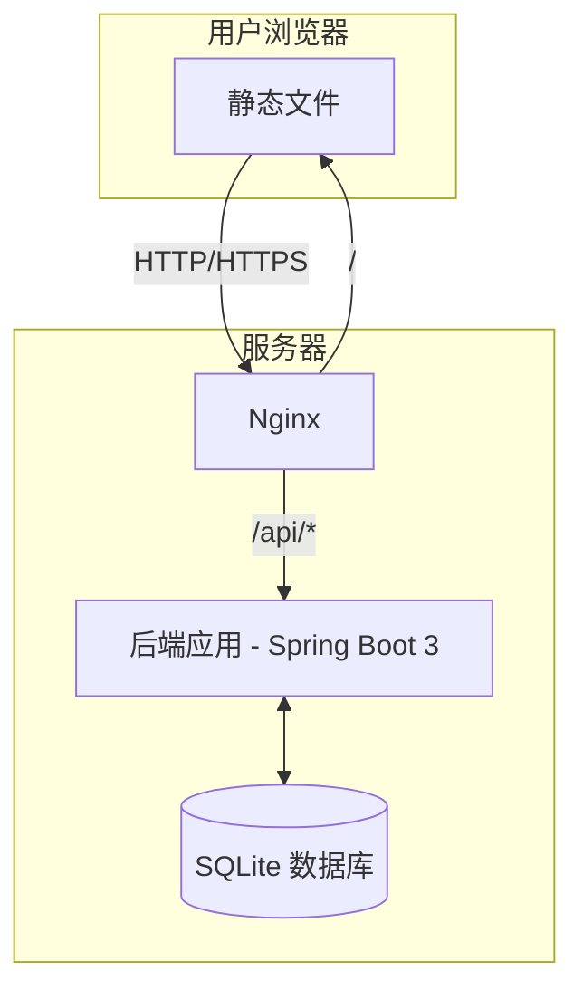
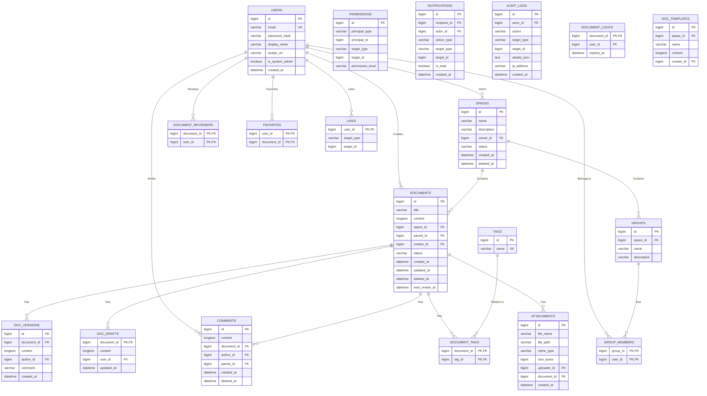

# 团队在线知识库概要设计说明书 - v1.0

## 1. 引言

### 1.1 目的
本文档旨在基于《团队在线知识库软件需求规格说明书 v2.1》的要求，为项目提供高层次的架构设计、技术选型和模块划分方案。本文档将作为后续详细设计和开发工作的核心指导。

### 1.2 项目概述
本项目旨在开发一个功能丰富的团队在线知识管理平台。系统采用前后端分离架构，后端基于 Spring Boot 3 提供 RESTful API 服务，前端基于 Vue 3 构建现代化的单页面应用 (SPA)，数据库选用轻量级的 SQLite 以简化部署和维护。

## 2. 系统架构

### 2.1 总体架构
系统采用经典的前后端分离架构，通过 Nginx 作为反向代理和静态资源服务器。

- **前端 (Frontend)**: 基于 Vue 3 的单页面应用，负责用户界面的渲染和交互逻辑。
- **后端 (Backend)**: 基于 Spring Boot 3 的微服务化应用，负责业务逻辑处理、数据持久化和 API 接口提供。
- **数据库 (Database)**: 使用 SQLite 文件数据库，嵌入在后端应用中，简化部署。
- **Nginx**: 作为反向代理，将 API 请求转发至后端服务，并托管前端静态文件。

### 2.2 技术选型

| 分层 | 技术/框架 | 版本/说明 |
| :--- | :--- | :--- |
| **前端** | **Vue.js** | 3.x |
| | **UI 框架** | Element Plus (遵循 Ant Design/Material Design 风格) |
| | **状态管理** | Pinia |
| | **路由** | Vue Router |
| | **构建工具** | Vite |
| | **Markdown 编辑器** | Cherry Markdown / Vditor (支持所见即所得、图表、公式) |
| **后端** | **核心框架** | Spring Boot 3.x |
| | **数据库** | SQLite (通过 a-la-t/spring-boot-starter-sqlite3 集成) |
| | **ORM** | Spring Data JPA / Hibernate |
| | **安全框架** | Spring Security 6 (处理认证、授权、CSRF、XSS 防护) |
| | **API 文档** | SpringDoc OpenAPI (Swagger UI) |
| | **全文检索** | SQLite FTS5 (内置全文检索引擎) |
| **部署** | **Web 服务器** | Nginx |
| | **运行环境** | JDK 17+ |

## 3. 模块设计

根据需求分析，系统核心功能可划分为以下几个主要模块：

1.  **用户与认证模块 (User & Auth Module)**
    - **职责**: 负责用户注册、登录、密码管理、个人资料维护。集成 Spring Security 实现基于 Token (JWT) 的认证机制和会话管理。

2.  **知识空间模块 (Space Module)**
    - **职责**: 管理知识空间 (Space) 的创建、配置、成员和角色分配。

3.  **文档与内容模块 (Document & Content Module)**
    - **职责**: 核心模块。负责文档和目录的 CRUD、Markdown 内容的渲染、版本控制、草稿管理、附件上传、标签管理、回收站功能。

4.  **权限管理模块 (Permission Module)**
    - **职责**: 实现基于角色 (RBAC) 的访问控制。管理系统级、空间级、文档级的权限策略，处理权限继承和覆盖逻辑。

5.  **搜索与发现模块 (Search & Discovery Module)**
    - **职责**: 提供全局内容检。利用 SQLite 的 FTS5 扩展实现高效的全文搜索，并支持按作者、标签、空间等条件进行高级筛选。

6.  **交互与通知模块 (Interaction & Notification Module)**
    - **职责**: 管理评论、点赞、收藏、@提及等用户交互功能。构建站内通知中心，并通过邮件异步发送通知。

7.  **系统管理模块 (System Admin Module)**
    - **职责**: 提供系统后台管理功能，包括用户管理、空间管理、系统配置、审计日志、数据分析报告等。

## 4. 数据库设计 (V2 - 优化版)

经过对需求文档的深度分析，我们提出以下优化后的数据库设计方案，以更好地支撑系统的复杂业务逻辑，尤其是在权限、协作和内容管理方面。

### 4.1 优化设计核心思路

1.  **引入通用权限模型 (ACL):** 放弃了简单的角色关联表，引入一个灵活的 `permissions` 表，可以为用户或用户组在不同层级（空间、文档）上授予不同权限，并支持继承。
2.  **明确实体状态：** 在核心表（如 `documents`, `spaces`）中增加了 `status` 字段来管理归档、草稿等状态，并使用软删除 (`deleted_at`) 来实现回收站功能。
3.  **丰富交互实体：** 增加了独立的表来管理收藏 (`favorites`)、点赞 (`likes`)、附件 (`attachments`) 和通知 (`notifications`)。
4.  **支撑协作与管理：** 增加了用户组 (`groups`, `group_members`)、编辑锁 (`document_locks`) 和审计日志 (`audit_logs`) 的设计，以满足企业级需求。
5.  **细化内容管理：** 增加了模板 (`doc_templates`) 和内容审查 (`document_reviewers`) 的支持。

### 4.2 E-R 图 (实体关系图)

### 4.3 核心表结构详细说明

| 表名 | 字段 | 类型 | 描述 |
| :--- | :--- | :--- | :--- |
| **users** | `id`, `email`, `password_hash`, `display_name`, `avatar_url`, `is_system_admin` | - | 用户核心信息。`is_system_admin` 标志全局管理员。 |
| **spaces** | `id`, `name`, `description`, `owner_id`, `status`, `deleted_at` | - | 知识空间。`status` (ACTIVE, ARCHIVED) 管理归档。`deleted_at` 用于软删除和回收站。 |
| **documents** | `id`, `title`, `content`, `space_id`, `parent_id`, `creator_id`, `status`, `deleted_at`, `next_review_at` | - | 文档与目录。`status` (PUBLISHED, DRAFT, ARCHIVED)。`deleted_at` 用于回收站。`next_review_at` 用于内容生命周期管理。 |
| **doc_versions** | `id`, `document_id`, `content`, `author_id`, `comment`, `created_at` | - | 文档版本历史。 |
| **doc_drafts** | `document_id`, `content`, `user_id`, `updated_at` | - | 存储每个用户的私人草稿，与已发布的 `documents.content` 分离。 |
| **attachments** | `id`, `file_name`, `file_path`, `mime_type`, `size_bytes`, `uploader_id`, `document_id` | - | 统一管理所有上传的附件（图片等）。 |
| **groups** | `id`, `space_id`, `name`, `description` | - | 空间内的用户组。 |
| **group_members** | `group_id`, `user_id` | - | 用户和用户组的多对多关系。 |
| **permissions** | `id`, `principal_type`, `principal_id`, `target_type`, `target_id`, `permission_level` | - | **核心权限表**。Principal 是主体（用户/组），Target 是客体（空间/文档）。 |
| **audit_logs** | `id`, `actor_id`, `action`, `target_type`, `target_id`, `details_json`, `ip_address` | - | 关键操作的审计日志。 |
| **document_locks** | `document_id`, `user_id`, `expires_at` | - | 实现编辑冲突防止机制。 |
| **document_reviewers** | `document_id`, `user_id` | - | 指定文档的内容负责人/审查者。 |
| **favorites** | `user_id`, `document_id` | - | 用户收藏的文档。 |
| **likes** | `user_id`, `target_type`, `target_id` | - | 通用的点赞表，可用于文档和评论。 |
| **doc_templates** | `id`, `space_id`, `name`, `content`, `creator_id` | - | 空间级文档模板。 |
| **notifications** | `id`, `recipient_id`, `actor_id`, `action_type`, `target_type`, `target_id`, `is_read` | - | 站内通知中心。 |

## 5. 核心 API 设计

API 接口遵循 RESTful 风格，以 `/api/v1` 作为统一前缀。

| 功能 | HTTP 方法 | URL | 描述 |
| :--- | :--- | :--- | :--- |
| **认证** | POST | `/api/v1/auth/register` | 用户注册 |
| | POST | `/api/v1/auth/login` | 用户登录，返回 JWT |
| | POST | `/api/v1/auth/logout` | 用户登出 |
| **用户** | GET | `/api/v1/users/me` | 获取当前用户信息 |
| | PUT | `/api/v1/users/me` | 更新当前用户信息 |
| **空间** | GET | `/api/v1/spaces` | 获取用户可访问的空间列表 |
| | POST | `/api/v1/spaces` | 创建新空间 |
| | GET | `/api/v1/spaces/{spaceId}` | 获取指定空间的详细信息 |
| | PUT | `/api/v1/spaces/{spaceId}` | 更新空间信息 |
| **文档** | GET | `/api/v1/spaces/{spaceId}/documents` | 获取空间下的文档树（目录结构） |
| | POST | `/api/v1/spaces/{spaceId}/documents` | 在空间或目录下创建新文档 |
| | GET | `/api/v1/documents/{docId}` | 获取单个文档的详细内容 |
| | PUT | `/api/v1/documents/{docId}` | 更新文档内容（创建新版本） |
| | DELETE | `/api/v1/documents/{docId}` | 删除文档（移入回收站） |
| **版本** | GET | `/api/v1/documents/{docId}/versions` | 获取文档的版本历史 |
| | POST | `/api/v1/documents/{docId}/versions/{versionId}/restore` | 恢复到指定版本 |
| **搜索** | GET | `/api/v1/search?q={keyword}` | 全局搜索 |

## 6. 前端设计

### 6.1 页面结构
前端应用主要包含以下页面（视图）：

- **Login.vue**: 登录/注册页。
- **DefaultLayout.vue**: 主应用布局，包含顶部导航栏、侧边栏和内容区。
- **Dashboard.vue**: 个人仪表盘。
- **SpaceView.vue**: 知识空间主视图，包含文档树导航和内容展示区。
- **DocumentEditor.vue**: 文档编辑器视图。
- **AdminLayout.vue**: 系统管理后台布局。
- **AdminDashboard.vue**: 后台管理仪表盘。

### 6.2 核心组件
- **TheHeader**: 全局顶部导航栏，包含 Logo、搜索框、通知中心、用户菜单。
- **SidebarNav**: 空间内的文档树形导航组件。
- **MarkdownEditor**: 封装的 Markdown 编辑器组件，处理内容编辑、图片上传、实时预览等。
- **DocumentRenderer**: 用于渲染展示 Markdown 内容的组件，处理代码高亮、Mermaid 图表、数学公式等。

## 7. 部署方案

采用 Docker 进行容器化部署，以简化环境配置和迁移。

1.  **后端 Dockerfile**: 基于 `openjdk:17-slim` 镜像，将打包好的 Spring Boot Jar 包复制到容器中。通过环境变量传入数据库文件路径、JWT 密钥等配置。
2.  **前端 Dockerfile**: 使用多阶段构建。第一阶段使用 `node:18-alpine` 镜像构建 Vue 应用，生成静态文件。第二阶段使用 `nginx:stable-alpine` 镜像，将构建好的静态文件和 Nginx 配置文件复制进去。
3.  **docker-compose.yml**: 编排前端和后端两个服务，配置网络、端口映射和数据卷，实现一键启动整个应用。

---
*文档结束*
