# 团队在线知识库详细设计说明书 - v1.0

## 1. 引言

### 1.1 目的
本文档基于《需求设计说明书》和《概要设计说明书》，提供系统各模块的详细设计实现方案，包括但不限于以下内容：
1. 每个模块的详细类设计，包含完整的类名、属性、方法签名及方法详细说明
2. 关键业务流程的时序图，展示对象间的交互细节
3. 所有API接口的详细定义，包括请求/响应数据结构、参数校验规则
4. 数据库表结构的详细说明及典型SQL操作示例
5. 异常处理机制设计，包含自定义错误码体系
6. 性能优化关键点及实现方案

### 1.2 文档结构
1. **系统架构设计**：
   - 后端架构图及层次说明
   - 前端架构图及组件结构
   - 数据流向图
2. **模块详细设计**：按功能模块划分，每个模块包含：
   - 模块职责说明
   - 类图及类详细说明
   - 关键流程时序图
   - 状态转换图（如适用）
3. **核心类设计**：重点类的详细设计，包括：
   - 类职责说明
   - 属性定义及约束
   - 方法实现逻辑伪代码
4. **API详细定义**：每个API包含：
   - HTTP方法及路径
   - 请求/响应数据结构定义
   - 参数校验规则
   - 权限要求
   - 业务逻辑处理流程
5. **数据库设计**：
   - 表结构详细定义
   - 索引设计
   - 典型CRUD操作SQL示例
   - 事务处理策略
6. **异常处理**：
   - 错误码分类体系
   - 异常捕获处理流程
   - 日志记录规范

## 2. 系统架构设计

### 2.1 后端架构设计

#### 2.1.1 总体架构图
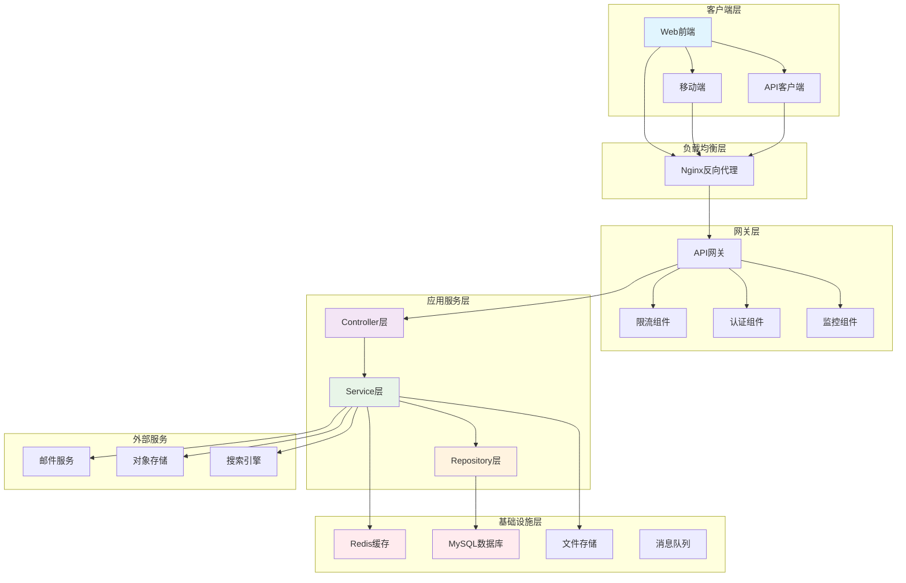

#### 2.1.2 分层架构详细说明

**Controller层（控制器层）**
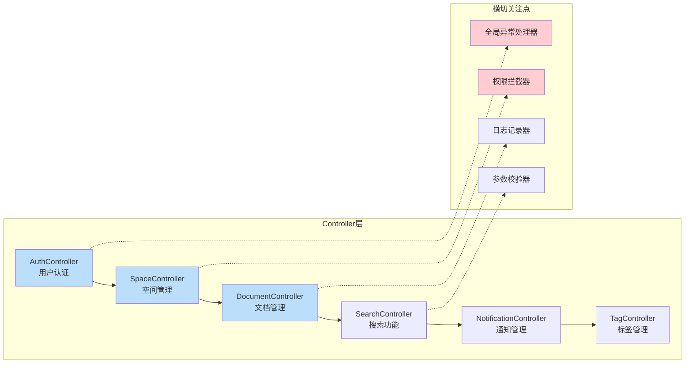

**Service层（业务逻辑层）**
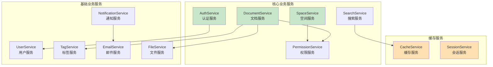

**Repository层（数据访问层）**
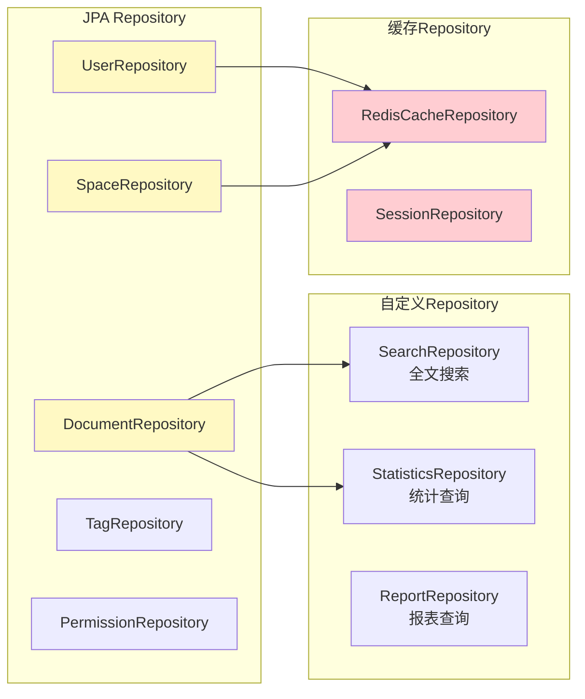

#### 2.1.3 数据流架构图
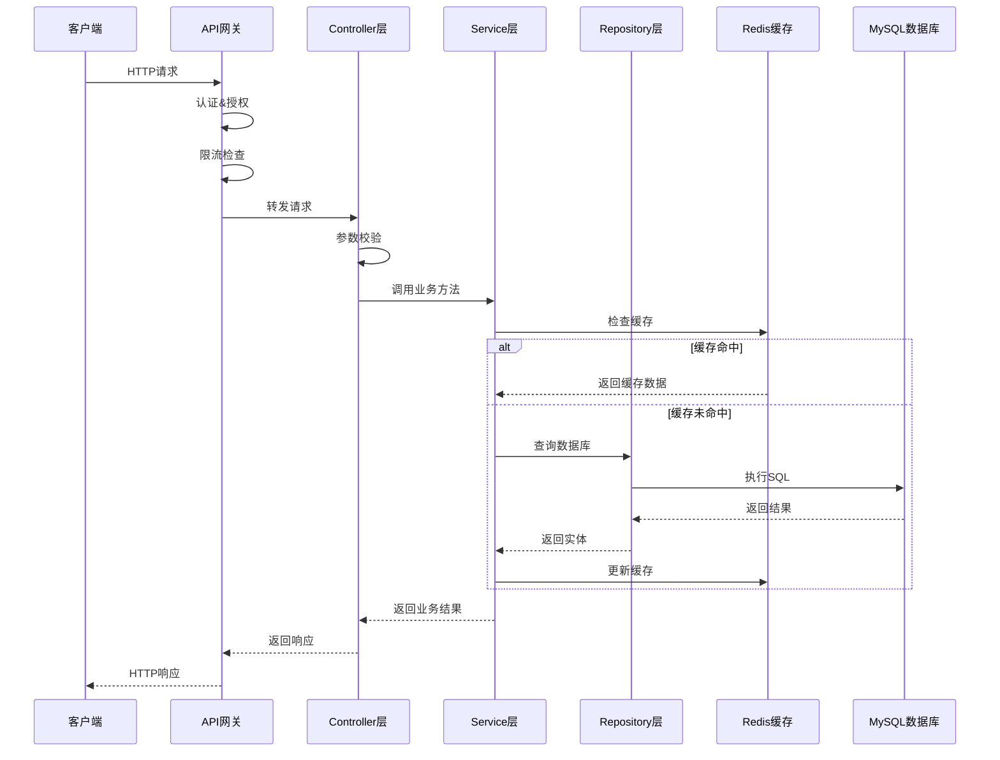

### 2.2 前端架构设计

#### 2.2.1 前端总体架构图
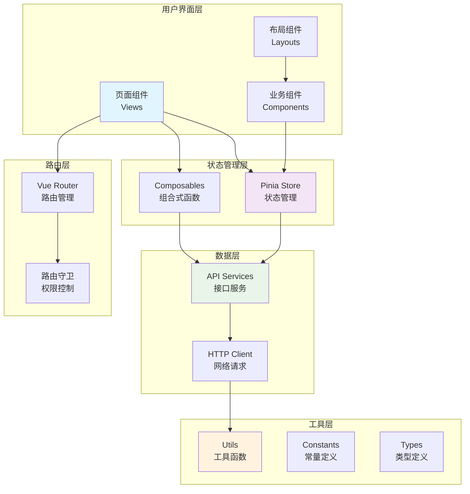

#### 2.2.2 组件层次结构图
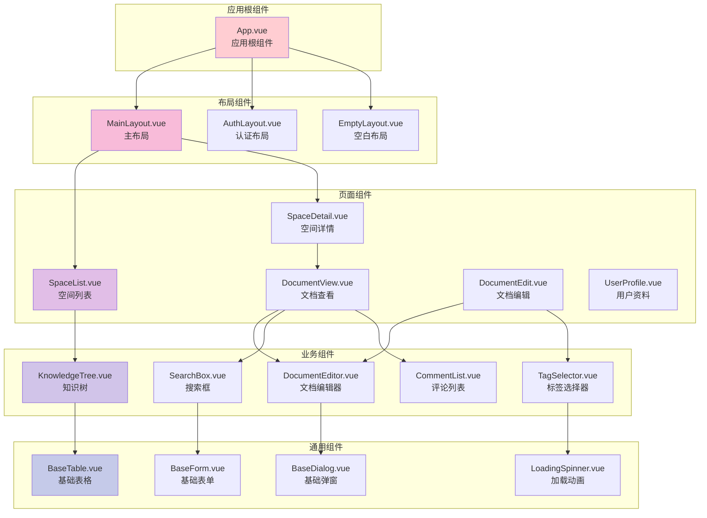

#### 2.2.3 状态管理架构图
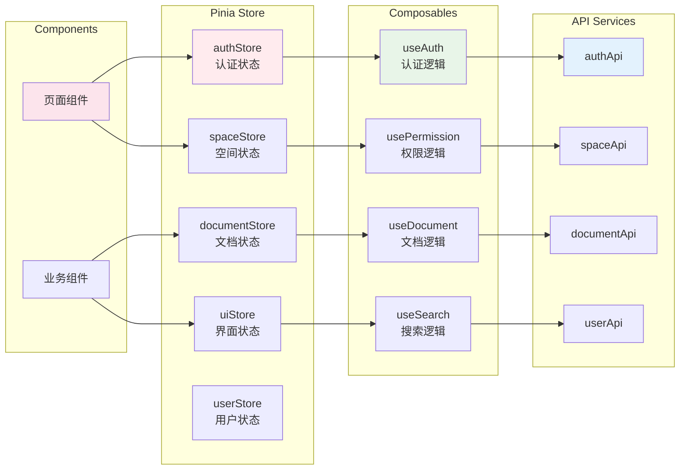

#### 2.2.4 数据流向图
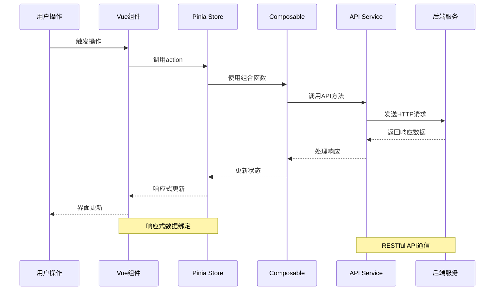

### 2.3 系统集成架构图
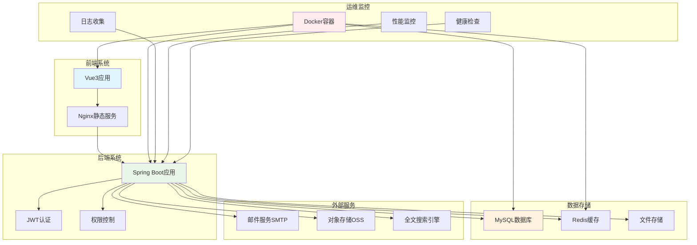

## 3. 模块详细设计

### 3.1 用户认证模块 (User Authentication Module)

#### 2.1.1 模块职责
1. 处理用户注册、登录、登出等认证相关功能
2. 管理JWT令牌的生成、验证和刷新
3. 提供密码加密和重置功能
4. 集成第三方认证（如OAuth2.0）
5. 用户会话管理和安全控制

#### 2.1.2 类详细设计
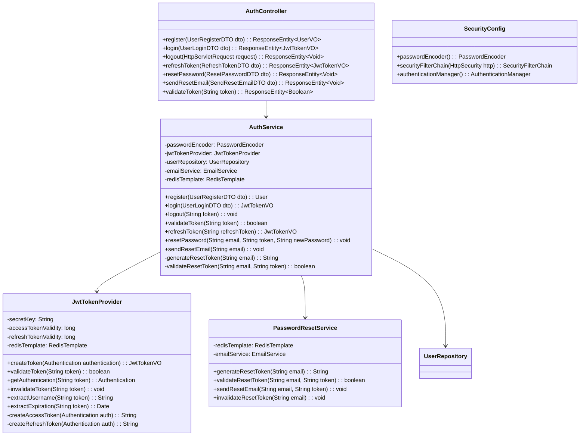

#### 2.1.3 类详细说明

##### AuthController
**职责**：处理所有认证相关的HTTP请求
**方法详细说明**：
- `register()`:
  - 校验注册参数（邮箱格式、密码强度等）
  - 检查邮箱是否已存在
  - 调用AuthService完成注册
- `login()`:
  - 验证用户凭证
  - 生成JWT令牌
  - 记录登录日志
- `logout()`:
  - 从请求头提取JWT令牌
  - 将令牌加入黑名单
  - 清除相关缓存
- `refreshToken()`:
  - 验证刷新令牌有效性
  - 生成新的访问令牌
- `resetPassword()`:
  - 验证重置令牌
  - 更新用户密码
- `sendResetEmail()`:
  - 发送密码重置邮件

##### AuthService
**职责**：核心认证业务逻辑实现
**关键属性**：
- `passwordEncoder`: BCrypt密码编码器
- `jwtTokenProvider`: JWT令牌处理器
- `redisTemplate`: Redis缓存操作

**方法实现逻辑**：
```java
// 用户注册逻辑伪代码
public User register(UserRegisterDTO dto) {
    // 1. 检查邮箱是否已存在
    if (userRepository.existsByEmail(dto.getEmail())) {
        throw new BusinessException("EMAIL_ALREADY_EXISTS");
    }

    // 2. 密码加密
    String encodedPassword = passwordEncoder.encode(dto.getPassword());

    // 3. 创建用户对象
    User user = User.builder()
        .email(dto.getEmail())
        .passwordHash(encodedPassword)
        .displayName(dto.getDisplayName())
        .isSystemAdmin(false)
        .createdAt(LocalDateTime.now())
        .build();

    // 4. 保存用户
    return userRepository.save(user);
}

// 用户登录逻辑伪代码
public JwtTokenVO login(UserLoginDTO dto) {
    // 1. 查找用户
    User user = userRepository.findByEmail(dto.getEmail())
        .orElseThrow(() -> new AuthenticationException("INVALID_CREDENTIALS"));

    // 2. 验证密码
    if (!passwordEncoder.matches(dto.getPassword(), user.getPasswordHash())) {
        throw new AuthenticationException("INVALID_CREDENTIALS");
    }

    // 3. 创建Authentication对象
    Authentication authentication = new UsernamePasswordAuthenticationToken(
        user, null, getAuthorities(user));

    // 4. 生成JWT令牌
    return jwtTokenProvider.createToken(authentication);
}
```

##### JwtTokenProvider
**职责**：JWT令牌的生成、验证和管理
**配置参数**：
- `secretKey`: JWT签名密钥，建议使用256位随机字符串
- `accessTokenValidity`: 访问令牌有效期（默认30分钟）
- `refreshTokenValidity`: 刷新令牌有效期（默认7天）

**令牌结构设计**：
```json
{
  "sub": "user@example.com",
  "userId": 12345,
  "displayName": "张三",
  "roles": ["USER"],
  "iat": 1640995200,
  "exp": 1640997000,
  "jti": "unique-token-id"
}
```

#### 2.1.4 关键流程时序图

##### 用户注册流程
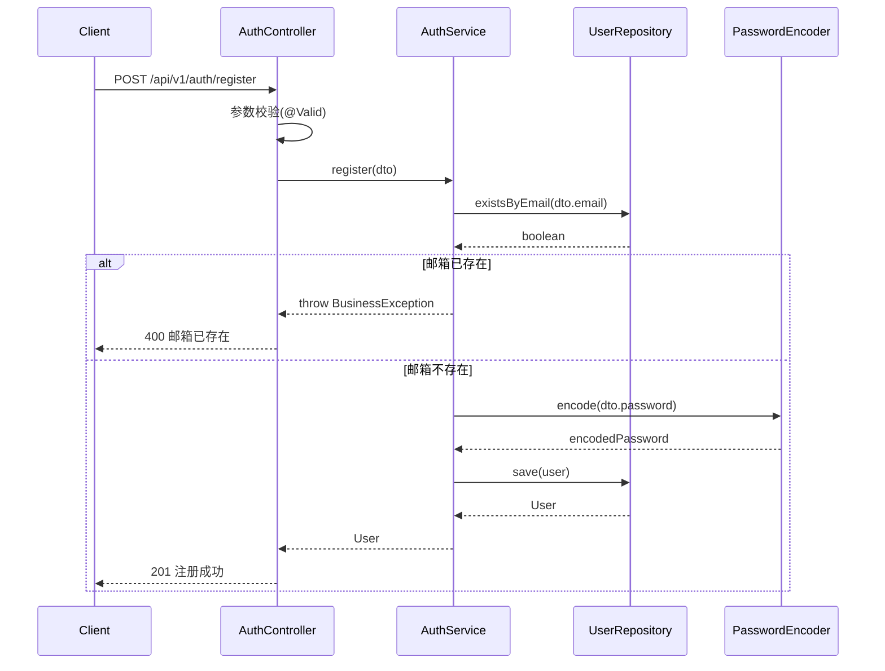

##### 用户登录流程
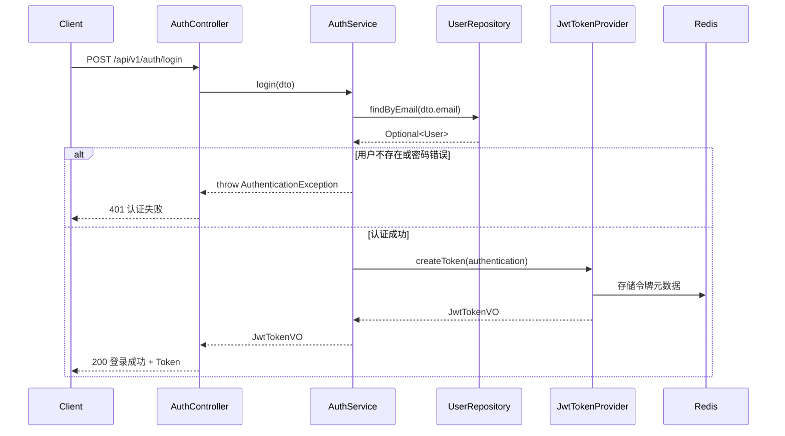

#### 2.1.5 数据结构定义

##### DTO类定义
```java
// 用户注册DTO
@Data
@Builder
public class UserRegisterDTO {
    @NotBlank(message = "邮箱不能为空")
    @Email(message = "邮箱格式不正确")
    @Size(max = 100, message = "邮箱长度不能超过100字符")
    private String email;

    @NotBlank(message = "密码不能为空")
    @Size(min = 8, max = 20, message = "密码长度必须在8-20字符之间")
    @Pattern(regexp = "^(?=.*[a-z])(?=.*[A-Z])(?=.*\\d)[a-zA-Z\\d@$!%*?&]{8,}$",
             message = "密码必须包含大小写字母和数字")
    private String password;

    @NotBlank(message = "显示名称不能为空")
    @Size(min = 2, max = 50, message = "显示名称长度必须在2-50字符之间")
    private String displayName;
}

// 用户登录DTO
@Data
@Builder
public class UserLoginDTO {
    @NotBlank(message = "邮箱不能为空")
    @Email(message = "邮箱格式不正确")
    private String email;

    @NotBlank(message = "密码不能为空")
    private String password;

    @Builder.Default
    private Boolean rememberMe = false;
}

// JWT令牌响应VO
@Data
@Builder
public class JwtTokenVO {
    private String accessToken;
    private String refreshToken;
    private String tokenType = "Bearer";
    private Long expiresIn; // 过期时间（秒）
    private Date expiresAt; // 过期时刻
    private UserInfoVO userInfo;
}

// 用户信息VO
@Data
@Builder
public class UserInfoVO {
    private Long id;
    private String email;
    private String displayName;
    private String avatarUrl;
    private Boolean isSystemAdmin;
    private LocalDateTime createdAt;
}
```

#### 2.1.6 安全配置
```java
@Configuration
@EnableWebSecurity
@EnableMethodSecurity
public class SecurityConfig {

    @Bean
    public PasswordEncoder passwordEncoder() {
        return new BCryptPasswordEncoder(12);
    }

    @Bean
    public SecurityFilterChain filterChain(HttpSecurity http) throws Exception {
        http
            .csrf(csrf -> csrf.disable())
            .sessionManagement(session ->
                session.sessionCreationPolicy(SessionCreationPolicy.STATELESS))
            .authorizeHttpRequests(auth -> auth
                .requestMatchers("/api/v1/auth/**").permitAll()
                .requestMatchers("/api/v1/public/**").permitAll()
                .requestMatchers("/healthz").permitAll()
                .anyRequest().authenticated())
            .addFilterBefore(jwtAuthenticationFilter(),
                           UsernamePasswordAuthenticationFilter.class)
            .exceptionHandling(ex -> ex
                .authenticationEntryPoint(authenticationEntryPoint())
                .accessDeniedHandler(accessDeniedHandler()));

        return http.build();
    }
}
```

#### 2.1.7 错误处理
```java
public enum AuthErrorCode {
    INVALID_CREDENTIALS("40001", "用户名或密码错误"),
    EMAIL_ALREADY_EXISTS("40002", "邮箱已存在"),
    TOKEN_EXPIRED("40003", "令牌已过期"),
    TOKEN_INVALID("40004", "令牌无效"),
    PASSWORD_RESET_TOKEN_EXPIRED("40005", "密码重置令牌已过期");

    private final String code;
    private final String message;
}
```

### 2.2 文档管理模块 (Document Management Module)

#### 2.2.1 模块职责
1. 文档和目录的CRUD操作
2. Markdown内容的处理和渲染
3. 文档版本控制和历史管理
4. 文档草稿管理和自动保存
5. 文档附件上传和管理
6. 文档标签和分类管理
7. 文档权限控制集成

#### 2.2.2 类详细设计
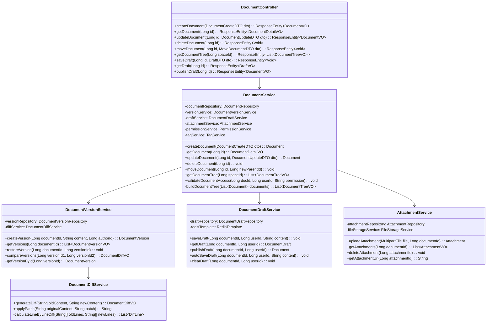

#### 2.2.3 类详细说明

##### DocumentController
**职责**：处理文档相关的HTTP请求
**关键方法**：
- `createDocument()`: 创建新文档或目录
- `getDocument()`: 获取文档详细信息
- `updateDocument()`: 更新文档内容（自动创建版本）
- `deleteDocument()`: 软删除文档（移入回收站）
- `moveDocument()`: 移动文档到新的父目录
- `getDocumentTree()`: 获取空间的文档树结构
- `saveDraft()`: 保存草稿
- `publishDraft()`: 发布草稿为正式版本

##### DocumentService
**职责**：文档业务逻辑核心实现

**创建文档流程伪代码**：
```java
public Document createDocument(DocumentCreateDTO dto) {
    // 1. 权限检查
    permissionService.validateSpaceAccess(dto.getSpaceId(), getCurrentUserId(), "CREATE");

    // 2. 验证父目录
    if (dto.getParentId() != null) {
        Document parent = documentRepository.findById(dto.getParentId())
            .orElseThrow(() -> new BusinessException("PARENT_NOT_FOUND"));
        permissionService.validateDocumentAccess(dto.getParentId(), getCurrentUserId(), "CREATE");
    }

    // 3. 创建文档对象
    Document document = Document.builder()
        .title(dto.getTitle())
        .content(dto.getContent())
        .spaceId(dto.getSpaceId())
        .parentId(dto.getParentId())
        .creatorId(getCurrentUserId())
        .status(DocumentStatus.PUBLISHED)
        .createdAt(LocalDateTime.now())
        .updatedAt(LocalDateTime.now())
        .build();

    // 4. 保存文档
    document = documentRepository.save(document);

    // 5. 创建初始版本
    versionService.createVersion(document.getId(), dto.getContent(), getCurrentUserId());

    // 6. 处理标签
    if (dto.getTags() != null && !dto.getTags().isEmpty()) {
        tagService.addTagsToDocument(document.getId(), dto.getTags());
    }

    return document;
}
```

**更新文档流程伪代码**：
```java
public Document updateDocument(Long id, DocumentUpdateDTO dto) {
    // 1. 获取文档
    Document document = documentRepository.findById(id)
        .orElseThrow(() -> new BusinessException("DOCUMENT_NOT_FOUND"));

    // 2. 权限检查
    permissionService.validateDocumentAccess(id, getCurrentUserId(), "EDIT");

    // 3. 检查编辑锁
    if (lockService.isLocked(id) && !lockService.isLockedByUser(id, getCurrentUserId())) {
        throw new BusinessException("DOCUMENT_LOCKED");
    }

    // 4. 内容变更检查
    if (!document.getContent().equals(dto.getContent())) {
        // 创建新版本
        versionService.createVersion(id, dto.getContent(), getCurrentUserId());
    }

    // 5. 更新文档
    document.setTitle(dto.getTitle());
    document.setContent(dto.getContent());
    document.setUpdatedAt(LocalDateTime.now());

    // 6. 保存更新
    return documentRepository.save(document);
}
```

##### DocumentVersionService
**职责**：文档版本管理

**版本创建策略**：
- 只有内容实质性变更时才创建新版本
- 版本创建时机：手动保存、发布草稿
- 自动草稿保存不创建版本

**版本对比算法**：
```java
public DocumentDiffVO compareVersions(Long versionId1, Long versionId2) {
    DocumentVersion version1 = getVersionById(versionId1);
    DocumentVersion version2 = getVersionById(versionId2);

    return diffService.generateDiff(version1.getContent(), version2.getContent());
}
```

##### DocumentDraftService
**职责**：草稿管理和自动保存

**草稿保存策略**：
- 每个用户对每个文档只能有一个草稿
- 草稿自动保存间隔：30秒
- 草稿过期时间：7天
- 使用Redis缓存最近的草稿内容

#### 2.2.4 关键流程时序图

##### 文档创建流程
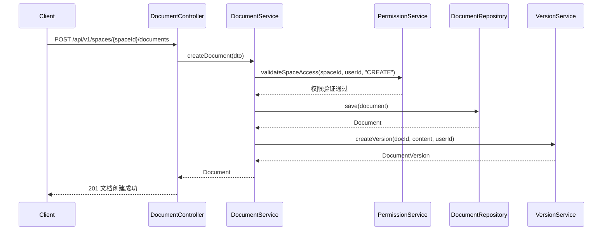

##### 文档更新流程
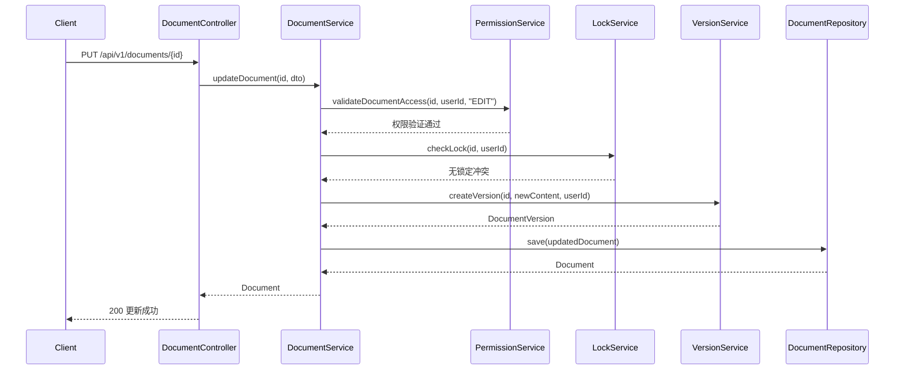

#### 2.2.5 数据结构定义

##### DTO类定义
```java
// 文档创建DTO
@Data
@Builder
public class DocumentCreateDTO {
    @NotBlank(message = "标题不能为空")
    @Size(max = 200, message = "标题长度不能超过200字符")
    private String title;

    private String content;

    @NotNull(message = "空间ID不能为空")
    private Long spaceId;

    private Long parentId; // null表示根目录

    private List<String> tags;

    @Builder.Default
    private DocumentType type = DocumentType.DOCUMENT; // DOCUMENT 或 DIRECTORY

    private Long templateId; // 基于模板创建
}

// 文档更新DTO
@Data
@Builder
public class DocumentUpdateDTO {
    @NotBlank(message = "标题不能为空")
    @Size(max = 200, message = "标题长度不能超过200字符")
    private String title;

    private String content;

    private List<String> tags;

    private String versionComment; // 版本说明
}

// 文档详细信息VO
@Data
@Builder
public class DocumentDetailVO {
    private Long id;
    private String title;
    private String content;
    private Long spaceId;
    private String spaceName;
    private Long parentId;
    private Long creatorId;
    private String creatorName;
    private DocumentStatus status;
    private LocalDateTime createdAt;
    private LocalDateTime updatedAt;
    private List<String> tags;
    private List<AttachmentVO> attachments;
    private DocumentPermissionVO permission;
    private Boolean hasLock;
    private String lockUser;
    private Boolean hasDraft;
}

// 文档树结构VO
@Data
@Builder
public class DocumentTreeVO {
    private Long id;
    private String title;
    private DocumentType type;
    private Long parentId;
    private List<DocumentTreeVO> children;
    private LocalDateTime updatedAt;
    private Boolean hasPermission;
}

// 文档版本VO
@Data
@Builder
public class DocumentVersionVO {
    private Long id;
    private Long documentId;
    private String content;
    private Long authorId;
    private String authorName;
    private String comment;
    private LocalDateTime createdAt;
    private Boolean isCurrent;
}

// 文档差异VO
@Data
@Builder
public class DocumentDiffVO {
    private Long version1Id;
    private Long version2Id;
    private String version1Title;
    private String version2Title;
    private LocalDateTime version1Date;
    private LocalDateTime version2Date;
    private List<DiffLineVO> diffLines;
    private DiffStatistics statistics;
}

@Data
@Builder
public class DiffLineVO {
    private Integer lineNumber;
    private DiffType type; // ADDED, DELETED, UNCHANGED, MODIFIED
    private String content;
    private String oldContent; // for MODIFIED lines
}

@Data
@Builder
public class DiffStatistics {
    private Integer addedLines;
    private Integer deletedLines;
    private Integer modifiedLines;
    private Integer unchangedLines;
}
```

#### 2.2.6 文档状态管理
```java
public enum DocumentStatus {
    DRAFT("草稿"),
    PUBLISHED("已发布"),
    ARCHIVED("已归档"),
    UNDER_REVIEW("审查中");

    private final String description;
}

public enum DocumentType {
    DOCUMENT("文档"),
    DIRECTORY("目录");

    private final String description;
}
```

#### 2.2.7 编辑锁机制
```java
@Service
public class DocumentLockService {
    private static final int LOCK_TIMEOUT_MINUTES = 30;

    @Autowired
    private RedisTemplate<String, Object> redisTemplate;

    public void acquireLock(Long documentId, Long userId) {
        String lockKey = "doc:lock:" + documentId;
        String lockValue = userId.toString();

        Boolean success = redisTemplate.opsForValue()
            .setIfAbsent(lockKey, lockValue, Duration.ofMinutes(LOCK_TIMEOUT_MINUTES));

        if (!success) {
            String currentLockUser = (String) redisTemplate.opsForValue().get(lockKey);
            if (!lockValue.equals(currentLockUser)) {
                throw new BusinessException("DOCUMENT_LOCKED_BY_OTHER_USER");
            }
        }
    }

    public void releaseLock(Long documentId, Long userId) {
        String lockKey = "doc:lock:" + documentId;
        String lockValue = userId.toString();

        // Lua脚本确保原子操作
        String luaScript = "if redis.call('get', KEYS[1]) == ARGV[1] then " +
                          "return redis.call('del', KEYS[1]) else return 0 end";

        redisTemplate.execute(new DefaultRedisScript<>(luaScript, Long.class),
                            Arrays.asList(lockKey), lockValue);
    }
}
```

### 2.3 知识空间模块 (Space Management Module)

#### 2.3.1 模块职责
1. 知识空间的CRUD管理
2. 空间成员和角色管理
3. 空间用户组管理
4. 空间配置和设置
5. 空间归档和删除

#### 2.3.2 类设计
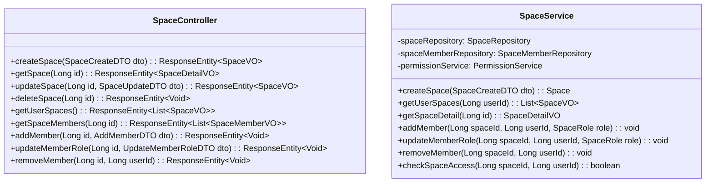

### 2.4 权限管理模块 (Permission Management Module)

#### 2.4.1 模块职责
1. 基于RBAC的权限控制
2. 空间级权限管理
3. 文档级权限管理
4. 权限继承和覆盖
5. 用户组权限管理

#### 2.4.2 类设计
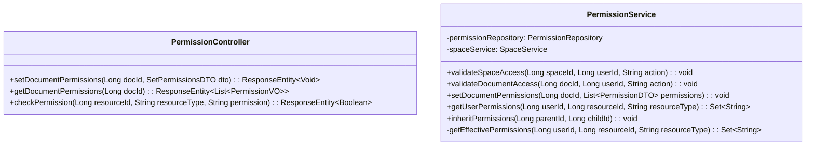

### 2.5 搜索模块 (Search Module)

#### 2.5.1 模块职责
1. 全文搜索实现
2. 高级搜索筛选
3. 搜索结果排序和分页
4. 搜索建议和自动补全
5. 搜索统计和分析

#### 2.5.2 类设计
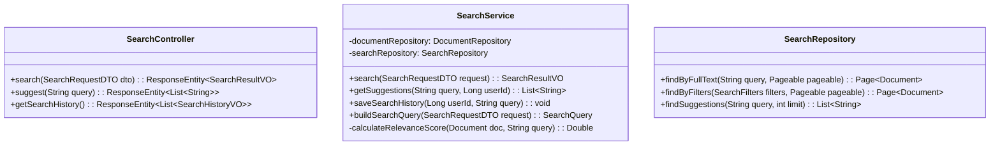

### 2.6 通知模块 (Notification Module)

#### 2.6.1 模块职责
1. 站内通知管理
2. 邮件通知发送
3. 通知订阅管理
4. 通知模板管理
5. 通知统计和分析

#### 2.6.2 类设计
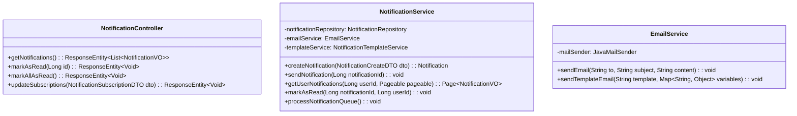

### 2.7 标签管理模块 (Tag Management Module)

#### 2.7.1 模块职责
1. 标签的CRUD操作管理
2. 标签自动补全和建议
3. 标签使用统计和分析
4. 标签颜色和样式管理
5. 文档标签关联管理
6. 标签合并和重命名
7. 热门标签推荐

#### 2.7.2 类详细设计
```mermaid
classDiagram
    class TagController {
        +createTag(TagCreateDTO dto): ResponseEntity~TagVO~
        +updateTag(Long id, TagUpdateDTO dto): ResponseEntity~TagVO~
        +deleteTag(Long id): ResponseEntity~Void~
        +getTags(TagQueryDTO dto): ResponseEntity~Page~TagVO~~
        +getPopularTags(int limit): ResponseEntity~List~TagVO~~
        +searchTags(String query): ResponseEntity~List~TagVO~~
        +mergeTags(TagMergeDTO dto): ResponseEntity~Void~
        +getTagStatistics(Long tagId): ResponseEntity~TagStatisticsVO~
    }

    class TagService {
        -tagRepository: TagRepository
        -documentTagRepository: DocumentTagRepository
        -redisTemplate: RedisTemplate

        +createTag(TagCreateDTO dto): Tag
        +updateTag(Long id, TagUpdateDTO dto): Tag
        +deleteTag(Long id): void
        +getTags(TagQueryDTO query): Page~TagVO~
        +addTagsToDocument(Long documentId, List~String~ tagNames): void
        +removeTagsFromDocument(Long documentId, List~Long~ tagIds): void
        +getDocumentTags(Long documentId): List~TagVO~
        +searchTagsWithAutoComplete(String query, int limit): List~TagVO~
        +getPopularTags(int limit): List~TagVO~
        +mergeTags(Long sourceTagId, Long targetTagId): void
        +updateTagUsageCount(Long tagId): void
        +getTagStatistics(Long tagId): TagStatisticsVO
        +getOrCreateTag(String name): Tag
        +cleanupUnusedTags(): int
    }

    class TagCacheService {
        -redisTemplate: RedisTemplate

        +cachePopularTags(List~TagVO~ tags): void
        +getCachedPopularTags(): List~TagVO~
        +cacheTagSuggestions(String query, List~TagVO~ suggestions): void
        +getCachedTagSuggestions(String query): List~TagVO~
        +invalidateTagCache(): void
        +invalidateTagSuggestionCache(String query): void
    }

    class TagRepository {
        +findByName(String name): Optional~Tag~
        +findByNameIgnoreCase(String name): Optional~Tag~
        +findByNameContainingIgnoreCase(String name, Pageable pageable): Page~Tag~
        +findTopByUsageCountDesc(Pageable pageable): List~Tag~
        +findUnusedTags(): List~Tag~
        +incrementUsageCount(Long tagId): void
        +decrementUsageCount(Long tagId): void
    }

    TagController --> TagService
    TagService --> TagRepository
    TagService --> TagCacheService
    TagService --> DocumentTagRepository
```

#### 2.7.3 类详细说明

##### TagController
**职责**：处理标签相关的HTTP请求
**关键方法**：
- `createTag()`: 创建新标签
- `updateTag()`: 更新标签信息（名称、颜色等）
- `deleteTag()`: 删除标签（需要处理关联的文档）
- `getTags()`: 分页获取标签列表
- `searchTags()`: 标签搜索和自动补全
- `mergeTags()`: 合并标签（将源标签的所有关联转移到目标标签）
- `getTagStatistics()`: 获取标签使用统计

##### TagService
**职责**：标签业务逻辑核心实现

**关键方法实现逻辑**：

```java
// 为文档添加标签
public void addTagsToDocument(Long documentId, List<String> tagNames) {
    // 1. 验证文档存在性
    if (!documentRepository.existsById(documentId)) {
        throw new BusinessException("DOCUMENT_NOT_FOUND");
    }

    // 2. 获取或创建标签
    List<Tag> tags = new ArrayList<>();
    for (String tagName : tagNames) {
        String normalizedName = normalizeTagName(tagName);
        Tag tag = getOrCreateTag(normalizedName);
        tags.add(tag);
    }

    // 3. 创建文档标签关联
    List<DocumentTag> documentTags = tags.stream()
        .map(tag -> DocumentTag.builder()
            .documentId(documentId)
            .tagId(tag.getId())
            .createdAt(LocalDateTime.now())
            .build())
        .collect(Collectors.toList());

    documentTagRepository.saveAll(documentTags);

    // 4. 更新标签使用计数
    tags.forEach(tag -> updateTagUsageCount(tag.getId()));

    // 5. 清除相关缓存
    tagCacheService.invalidateTagCache();
}

// 标签自动补全搜索
public List<TagVO> searchTagsWithAutoComplete(String query, int limit) {
    // 1. 先从缓存获取
    List<TagVO> cached = tagCacheService.getCachedTagSuggestions(query);
    if (cached != null) {
        return cached;
    }

    // 2. 数据库搜索
    String normalizedQuery = normalizeTagName(query);
    Pageable pageable = PageRequest.of(0, limit, Sort.by("usageCount").descending());

    List<Tag> tags = tagRepository.findByNameContainingIgnoreCase(normalizedQuery, pageable)
        .getContent();

    // 3. 转换为VO
    List<TagVO> result = tags.stream()
        .map(this::convertToVO)
        .collect(Collectors.toList());

    // 4. 缓存结果
    tagCacheService.cacheTagSuggestions(query, result);

    return result;
}

// 标签合并
public void mergeTags(Long sourceTagId, Long targetTagId) {
    // 1. 验证标签存在性
    Tag sourceTag = tagRepository.findById(sourceTagId)
        .orElseThrow(() -> new BusinessException("SOURCE_TAG_NOT_FOUND"));
    Tag targetTag = tagRepository.findById(targetTagId)
        .orElseThrow(() -> new BusinessException("TARGET_TAG_NOT_FOUND"));

    // 2. 事务处理合并操作
    transactionTemplate.execute(status -> {
        // 2.1 更新所有使用源标签的文档
        documentTagRepository.updateTagId(sourceTagId, targetTagId);

        // 2.2 更新目标标签使用计数
        long sourceUsageCount = sourceTag.getUsageCount();
        targetTag.setUsageCount(targetTag.getUsageCount() + sourceUsageCount);
        tagRepository.save(targetTag);

        // 2.3 删除源标签
        tagRepository.delete(sourceTag);

        // 2.4 记录审计日志
        auditService.logAction("TAG_MERGED", getCurrentUserId(), "TAG", targetTagId);

        return null;
    });

    // 3. 清除缓存
    tagCacheService.invalidateTagCache();
}

// 获取或创建标签
public Tag getOrCreateTag(String name) {
    String normalizedName = normalizeTagName(name);

    return tagRepository.findByNameIgnoreCase(normalizedName)
        .orElseGet(() -> {
            Tag newTag = Tag.builder()
                .name(normalizedName)
                .color(generateRandomColor())
                .usageCount(0L)
                .createdAt(LocalDateTime.now())
                .build();
            return tagRepository.save(newTag);
        });
}

// 标签名称规范化
private String normalizeTagName(String name) {
    if (name == null) return null;

    return name.trim()
        .toLowerCase()
        .replaceAll("\\s+", "-")  // 空格转为连字符
        .replaceAll("[^a-zA-Z0-9\\u4e00-\\u9fa5-]", "")  // 只保留字母、数字、中文、连字符
        .substring(0, Math.min(name.length(), 30));  // 限制长度
}
```

##### TagCacheService
**职责**：标签相关数据的缓存管理

**缓存策略**：
- 热门标签：缓存1小时
- 搜索建议：缓存30分钟
- 标签统计：缓存15分钟

#### 2.7.4 数据结构定义

##### DTO类定义
```java
// 标签创建DTO
@Data
@Builder
public class TagCreateDTO {
    @NotBlank(message = "标签名称不能为空")
    @Size(min = 1, max = 30, message = "标签名称长度必须在1-30字符之间")
    @Pattern(regexp = "^[a-zA-Z0-9\\u4e00-\\u9fa5\\-_]+$",
             message = "标签名称只能包含字母、数字、中文、连字符和下划线")
    private String name;

    @Pattern(regexp = "^#[0-9A-Fa-f]{6}$", message = "颜色值格式不正确")
    private String color;

    private String description;
}

// 标签更新DTO
@Data
@Builder
public class TagUpdateDTO {
    @Size(min = 1, max = 30, message = "标签名称长度必须在1-30字符之间")
    @Pattern(regexp = "^[a-zA-Z0-9\\u4e00-\\u9fa5\\-_]+$",
             message = "标签名称只能包含字母、数字、中文、连字符和下划线")
    private String name;

    @Pattern(regexp = "^#[0-9A-Fa-f]{6}$", message = "颜色值格式不正确")
    private String color;

    private String description;
}

// 标签查询DTO
@Data
@Builder
public class TagQueryDTO {
    private String name;        // 按名称筛选
    private String color;       // 按颜色筛选
    private Long minUsageCount; // 最小使用次数
    private Long maxUsageCount; // 最大使用次数
    private LocalDate createdAfter;  // 创建时间起始
    private LocalDate createdBefore; // 创建时间结束
    private String sortBy = "usageCount"; // 排序字段
    private String sortOrder = "desc";    // 排序方向

    @Min(0)
    private int page = 0;

    @Min(1)
    @Max(100)
    private int size = 20;
}

// 标签合并DTO
@Data
@Builder
public class TagMergeDTO {
    @NotNull(message = "源标签ID不能为空")
    private Long sourceTagId;

    @NotNull(message = "目标标签ID不能为空")
    private Long targetTagId;

    private String reason; // 合并原因
}

// 标签VO
@Data
@Builder
public class TagVO {
    private Long id;
    private String name;
    private String color;
    private String description;
    private Long usageCount;
    private LocalDateTime createdAt;
    private LocalDateTime updatedAt;
    private Boolean canEdit;    // 当前用户是否可编辑
    private Boolean canDelete;  // 当前用户是否可删除
}

// 标签统计VO
@Data
@Builder
public class TagStatisticsVO {
    private Long tagId;
    private String tagName;
    private Long totalUsageCount;
    private Long documentsCount;
    private Long spacesCount;
    private List<SpaceUsageVO> spaceUsage;
    private List<UserUsageVO> topUsers;
    private Map<String, Long> monthlyUsage; // 月度使用趋势
}

@Data
@Builder
public class SpaceUsageVO {
    private Long spaceId;
    private String spaceName;
    private Long usageCount;
}

@Data
@Builder
public class UserUsageVO {
    private Long userId;
    private String userName;
    private Long usageCount;
}
```

#### 2.7.5 关键业务流程

##### 标签自动补全流程
```mermaid
sequenceDiagram
    participant Client
    participant TagController
    participant TagService
    participant TagCacheService
    participant TagRepository

    Client->>TagController: GET /api/v1/tags/suggest?q=api
    TagController->>TagService: searchTagsWithAutoComplete("api", 10)
    TagService->>TagCacheService: getCachedTagSuggestions("api")

    alt 缓存命中
        TagCacheService-->>TagService: List<TagVO>
        TagService-->>TagController: List<TagVO>
    else 缓存未命中
        TagService->>TagRepository: findByNameContainingIgnoreCase("api", pageable)
        TagRepository-->>TagService: Page<Tag>
        TagService->>TagCacheService: cacheTagSuggestions("api", suggestions)
        TagService-->>TagController: List<TagVO>
    end

    TagController-->>Client: 200 标签建议列表
```

##### 文档标签添加流程
```mermaid
sequenceDiagram
    participant DocumentService
    participant TagService
    participant TagRepository
    participant DocumentTagRepository

    DocumentService->>TagService: addTagsToDocument(docId, ["API", "设计"])

    loop 每个标签名称
        TagService->>TagService: normalizeTagName(tagName)
        TagService->>TagRepository: findByNameIgnoreCase(normalizedName)

        alt 标签存在
            TagRepository-->>TagService: Tag
        else 标签不存在
            TagService->>TagRepository: save(newTag)
            TagRepository-->>TagService: Tag
        end
    end

    TagService->>DocumentTagRepository: saveAll(documentTags)
    TagService->>TagRepository: incrementUsageCount(tagIds)
    TagService->>TagCacheService: invalidateTagCache()
```

### 2.8 用户组管理模块 (Group Management Module)

#### 2.8.1 模块职责
1. 空间内用户组的CRUD操作
2. 用户组成员管理
3. 用户组权限分配
4. 用户组批量操作
5. 用户组权限继承

#### 2.8.2 类详细设计
```mermaid
classDiagram
    class GroupController {
        +createGroup(Long spaceId, GroupCreateDTO dto): ResponseEntity~GroupVO~
        +updateGroup(Long id, GroupUpdateDTO dto): ResponseEntity~GroupVO~
        +deleteGroup(Long id): ResponseEntity~Void~
        +getSpaceGroups(Long spaceId): ResponseEntity~List~GroupVO~~
        +addMembers(Long id, AddGroupMembersDTO dto): ResponseEntity~Void~
        +removeMembers(Long id, RemoveGroupMembersDTO dto): ResponseEntity~Void~
        +getGroupMembers(Long id): ResponseEntity~List~GroupMemberVO~~
    }

    class GroupService {
        -groupRepository: GroupRepository
        -groupMemberRepository: GroupMemberRepository
        -permissionService: PermissionService
        -spaceService: SpaceService

        +createGroup(Long spaceId, GroupCreateDTO dto): Group
        +updateGroup(Long id, GroupUpdateDTO dto): Group
        +deleteGroup(Long id): void
        +getSpaceGroups(Long spaceId): List~GroupVO~
        +addMembersToGroup(Long groupId, List~Long~ userIds): void
        +removeMembersFromGroup(Long groupId, List~Long~ userIds): void
        +getGroupMembers(Long groupId): List~GroupMemberVO~
        +validateGroupAccess(Long groupId, Long userId): void
        +getGroupPermissions(Long groupId): List~PermissionVO~
        +setGroupPermissions(Long groupId, List~PermissionDTO~ permissions): void
    }

    class GroupRepository {
        +findBySpaceId(Long spaceId): List~Group~
        +findBySpaceIdAndName(Long spaceId, String name): Optional~Group~
        +countBySpaceId(Long spaceId): Long
    }

    class GroupMemberRepository {
        +findByGroupId(Long groupId): List~GroupMember~
        +findByUserId(Long userId): List~GroupMember~
        +findByGroupIdAndUserId(Long groupId, Long userId): Optional~GroupMember~
        +deleteByGroupIdAndUserIdIn(Long groupId, List~Long~ userIds): void
    }

    GroupController --> GroupService
    GroupService --> GroupRepository
    GroupService --> GroupMemberRepository
    GroupService --> PermissionService
```

#### 2.8.3 数据结构定义
```java
// 用户组创建DTO
@Data
@Builder
public class GroupCreateDTO {
    @NotBlank(message = "用户组名称不能为空")
    @Size(min = 2, max = 50, message = "用户组名称长度必须在2-50字符之间")
    private String name;

    @Size(max = 200, message = "描述长度不能超过200字符")
    private String description;

    private List<Long> initialMembers; // 初始成员ID列表
}

// 用户组VO
@Data
@Builder
public class GroupVO {
    private Long id;
    private String name;
    private String description;
    private Long spaceId;
    private String spaceName;
    private Integer memberCount;
    private LocalDateTime createdAt;
    private LocalDateTime updatedAt;
    private Boolean canEdit;
    private Boolean canDelete;
}
```

### 2.9 文档模板管理模块 (Document Template Module)

#### 2.9.1 模块职责
1. 文档模板的CRUD操作
2. 模板分类和标签管理
3. 模板使用统计
4. 模板权限管理
5. 基于模板创建文档

#### 2.9.2 类详细设计
```mermaid
classDiagram
    class TemplateController {
        +createTemplate(Long spaceId, TemplateCreateDTO dto): ResponseEntity~TemplateVO~
        +updateTemplate(Long id, TemplateUpdateDTO dto): ResponseEntity~TemplateVO~
        +deleteTemplate(Long id): ResponseEntity~Void~
        +getSpaceTemplates(Long spaceId): ResponseEntity~List~TemplateVO~~
        +getTemplate(Long id): ResponseEntity~TemplateDetailVO~
        +createDocumentFromTemplate(Long templateId, CreateFromTemplateDTO dto): ResponseEntity~DocumentVO~
    }

    class TemplateService {
        -templateRepository: TemplateRepository
        -documentService: DocumentService
        -permissionService: PermissionService

        +createTemplate(Long spaceId, TemplateCreateDTO dto): DocumentTemplate
        +updateTemplate(Long id, TemplateUpdateDTO dto): DocumentTemplate
        +deleteTemplate(Long id): void
        +getSpaceTemplates(Long spaceId): List~TemplateVO~
        +getTemplateDetail(Long id): TemplateDetailVO
        +createDocumentFromTemplate(Long templateId, CreateFromTemplateDTO dto): Document
        +incrementTemplateUsage(Long templateId): void
    }
```

### 2.10 数据导入导出模块 (Import Export Module)

#### 2.10.1 模块职责
1. 单个Markdown文件导入
2. ZIP压缩包批量导入
3. 文档导出为MD/PDF格式
4. 目录和空间批量导出
5. 第三方平台数据迁移

#### 2.10.2 类详细设计
```mermaid
classDiagram
    class ImportExportController {
        +importMarkdownFile(Long spaceId, MultipartFile file): ResponseEntity~ImportResultVO~
        +importZipFile(Long spaceId, MultipartFile file): ResponseEntity~ImportResultVO~
        +exportDocument(Long docId, ExportFormat format): ResponseEntity~Resource~
        +exportDirectory(Long dirId, ExportFormat format): ResponseEntity~Resource~
        +exportSpace(Long spaceId, ExportFormat format): ResponseEntity~Resource~
    }

    class ImportService {
        -documentService: DocumentService
        -attachmentService: AttachmentService
        -fileStorageService: FileStorageService

        +importMarkdownFile(Long spaceId, MultipartFile file, Long parentId): ImportResult
        +importZipFile(Long spaceId, MultipartFile file, Long parentId): ImportResult
        +parseMarkdownContent(String content): ParsedContent
        +extractImagesFromZip(ZipFile zipFile): List~AttachmentInfo~
        +validateImportFile(MultipartFile file): ValidationResult
    }

    class ExportService {
        -documentService: DocumentService
        -pdfGeneratorService: PdfGeneratorService

        +exportDocumentAsMarkdown(Long docId): byte[]
        +exportDocumentAsPdf(Long docId): byte[]
        +exportDirectoryAsZip(Long dirId): byte[]
        +exportSpaceAsZip(Long spaceId): byte[]
        +generateDocumentPdf(Document doc): byte[]
    }
```

### 2.11 回收站管理模块 (Recycle Bin Module)

#### 2.11.1 模块职责
1. 软删除文档和目录管理
2. 回收站内容查看和搜索
3. 文档恢复功能
4. 永久删除功能
5. 自动清理策略

#### 2.11.2 类详细设计
```mermaid
classDiagram
    class RecycleBinController {
        +getRecycleBinContents(Long spaceId): ResponseEntity~List~RecycleBinItemVO~~
        +restoreItems(RestoreItemsDTO dto): ResponseEntity~Void~
        +permanentlyDeleteItems(DeleteItemsDTO dto): ResponseEntity~Void~
        +emptyRecycleBin(Long spaceId): ResponseEntity~Void~
    }

    class RecycleBinService {
        -documentRepository: DocumentRepository
        -permissionService: PermissionService

        +getRecycleBinContents(Long spaceId): List~RecycleBinItemVO~
        +restoreDocument(Long docId): void
        +permanentlyDeleteDocument(Long docId): void
        +emptySpaceRecycleBin(Long spaceId): void
        +autoCleanupExpiredItems(): int
        +validateRestorePermission(Long docId, Long userId): void
    }
```

### 2.12 内容生命周期管理模块 (Content Lifecycle Module)

#### 2.12.1 模块职责
1. 文档审查周期管理
2. 内容负责人指派
3. 审查提醒和通知
4. 内容归档管理
5. 生命周期统计分析

#### 2.12.2 类详细设计
```mermaid
classDiagram
    class ContentLifecycleController {
        +setReviewPolicy(Long docId, ReviewPolicyDTO dto): ResponseEntity~Void~
        +getReviewTasks(): ResponseEntity~List~ReviewTaskVO~~
        +completeReview(Long docId, ReviewCompleteDTO dto): ResponseEntity~Void~
        +archiveContent(ArchiveContentDTO dto): ResponseEntity~Void~
        +getLifecycleStats(Long spaceId): ResponseEntity~LifecycleStatsVO~
    }

    class ContentLifecycleService {
        -documentRepository: DocumentRepository
        -reviewTaskRepository: ReviewTaskRepository
        -notificationService: NotificationService

        +setDocumentReviewPolicy(Long docId, ReviewPolicyDTO dto): void
        +scheduleReviewReminders(): void
        +getUserReviewTasks(Long userId): List~ReviewTaskVO~
        +completeDocumentReview(Long docId, Long reviewerId): void
        +archiveDocuments(List~Long~ docIds): void
        +getContentLifecycleStats(Long spaceId): LifecycleStatsVO
    }
```

### 2.13 文档分享模块 (Document Sharing Module)

#### 2.13.1 模块职责
1. 内部用户/用户组分享
2. 邮件分享功能
3. 公开链接分享
4. 分享权限控制
5. 分享统计和追踪

#### 2.13.2 类详细设计
```mermaid
classDiagram
    class SharingController {
        +shareWithUsers(Long docId, ShareWithUsersDTO dto): ResponseEntity~Void~
        +shareViaEmail(Long docId, ShareViaEmailDTO dto): ResponseEntity~Void~
        +createPublicLink(Long docId, PublicLinkDTO dto): ResponseEntity~PublicLinkVO~
        +getDocumentShares(Long docId): ResponseEntity~List~ShareInfoVO~~
        +revokeShare(Long shareId): ResponseEntity~Void~
    }

    class SharingService {
        -shareRepository: ShareRepository
        -emailService: EmailService
        -permissionService: PermissionService

        +shareDocumentWithUsers(Long docId, List~Long~ userIds, String message): void
        +shareDocumentViaEmail(Long docId, List~String~ emails, String message): void
        +createPublicShareLink(Long docId, PublicLinkConfig config): PublicLink
        +getDocumentShares(Long docId): List~ShareInfoVO~
        +revokeShare(Long shareId): void
        +trackShareAccess(String shareToken): void
    }
```

### 2.14 系统管理模块 (System Administration Module)

#### 2.14.1 模块职责
1. 用户管理
2. 系统配置管理
3. 审计日志管理
4. 数据分析和报告
5. 系统监控和健康检查

#### 2.8.2 类设计
```mermaid
classDiagram
    class AdminController {
        +getSystemStats(): ResponseEntity~SystemStatsVO~
        +getUserList(UserQueryDTO dto): ResponseEntity~Page~UserVO~~
        +updateUser(Long id, AdminUserUpdateDTO dto): ResponseEntity~UserVO~
        +getAuditLogs(AuditLogQueryDTO dto): ResponseEntity~Page~AuditLogVO~~
        +getSystemConfig(): ResponseEntity~SystemConfigVO~
        +updateSystemConfig(SystemConfigDTO dto): ResponseEntity~Void~
    }

    class AdminService {
        -userRepository: UserRepository
        -auditLogRepository: AuditLogRepository
        -systemConfigRepository: SystemConfigRepository

        +getSystemStatistics(): SystemStatsVO
        +getUserManagementData(UserQueryDTO query): Page~UserVO~
        +updateUserStatus(Long userId, UserStatus status): void
        +getAuditLogs(AuditLogQueryDTO query): Page~AuditLogVO~
        +updateSystemConfiguration(SystemConfigDTO config): void
    }

    class AuditService {
        -auditLogRepository: AuditLogRepository

        +logAction(String action, Long actorId, String targetType, Long targetId): void
        +logUserAction(UserActionType action, Long userId, String details): void
        +logSystemAction(SystemActionType action, String details): void
        +getAuditTrail(Long resourceId, String resourceType): List~AuditLogVO~
    }
```

## 3. API详细定义

### 3.1 认证相关API

#### 3.1.1 用户注册
**POST** `/api/v1/auth/register`

**描述**: 用户注册新账户

**请求体**:
```json
{
  "email": "user@example.com",
  "password": "SecurePassword123",
  "displayName": "张三"
}
```

**参数校验**:
- `email`: 必填，有效邮箱格式，最长100字符
- `password`: 必填，8-20字符，包含大小写字母和数字
- `displayName`: 必填，2-50字符

**响应体**:
```json
{
  "code": 200,
  "message": "注册成功",
  "data": {
    "id": 12345,
    "email": "user@example.com",
    "displayName": "张三",
    "avatarUrl": null,
    "isSystemAdmin": false,
    "createdAt": "2024-01-15T10:30:00"
  }
}
```

**错误响应**:
- `40002`: 邮箱已存在
- `40000`: 参数校验失败

#### 3.1.2 用户登录
**POST** `/api/v1/auth/login`

**描述**: 用户登录获取JWT令牌

**请求体**:
```json
{
  "email": "user@example.com",
  "password": "SecurePassword123",
  "rememberMe": false
}
```

**响应体**:
```json
{
  "code": 200,
  "message": "登录成功",
  "data": {
    "accessToken": "eyJhbGciOiJIUzI1NiIsInR5cCI6IkpXVCJ9...",
    "refreshToken": "def50200abc123...",
    "tokenType": "Bearer",
    "expiresIn": 1800,
    "expiresAt": "2024-01-15T11:00:00",
    "userInfo": {
      "id": 12345,
      "email": "user@example.com",
      "displayName": "张三",
      "avatarUrl": null,
      "isSystemAdmin": false
    }
  }
}
```

#### 3.1.3 令牌刷新
**POST** `/api/v1/auth/refresh`

**请求体**:
```json
{
  "refreshToken": "def50200abc123..."
}
```

#### 3.1.4 用户登出
**POST** `/api/v1/auth/logout`

**请求头**: `Authorization: Bearer {accessToken}`

**响应体**:
```json
{
  "code": 200,
  "message": "登出成功"
}
```

### 3.2 用户管理API

#### 3.2.1 获取当前用户信息
**GET** `/api/v1/users/me`

**权限要求**: 已认证用户

**响应体**:
```json
{
  "code": 200,
  "data": {
    "id": 12345,
    "email": "user@example.com",
    "displayName": "张三",
    "avatarUrl": "https://example.com/avatars/12345.jpg",
    "isSystemAdmin": false,
    "createdAt": "2024-01-01T00:00:00",
    "preferences": {
      "theme": "light",
      "language": "zh-CN",
      "emailNotifications": true
    }
  }
}
```

#### 3.2.2 更新用户信息
**PUT** `/api/v1/users/me`

**请求体**:
```json
{
  "displayName": "新名称",
  "preferences": {
    "theme": "dark",
    "emailNotifications": false
  }
}
```

### 3.3 空间管理API

#### 3.3.1 创建知识空间
**POST** `/api/v1/spaces`

**权限要求**: 已认证用户

**请求体**:
```json
{
  "name": "技术文档空间",
  "description": "存放技术相关文档",
  "isPublic": false
}
```

**响应体**:
```json
{
  "code": 201,
  "message": "空间创建成功",
  "data": {
    "id": 1001,
    "name": "技术文档空间",
    "description": "存放技术相关文档",
    "ownerId": 12345,
    "ownerName": "张三",
    "isPublic": false,
    "status": "ACTIVE",
    "memberCount": 1,
    "documentCount": 0,
    "createdAt": "2024-01-15T10:30:00"
  }
}
```

#### 3.3.2 获取用户空间列表
**GET** `/api/v1/spaces`

**查询参数**:
- `page`: 页码（默认0）
- `size`: 页大小（默认20）
- `status`: 空间状态筛选（ACTIVE, ARCHIVED）
- `role`: 用户角色筛选（OWNER, ADMIN, EDITOR, VIEWER）

**响应体**:
```json
{
  "code": 200,
  "data": {
    "content": [
      {
        "id": 1001,
        "name": "技术文档空间",
        "description": "存放技术相关文档",
        "role": "OWNER",
        "memberCount": 5,
        "documentCount": 23,
        "lastActivity": "2024-01-15T09:45:00"
      }
    ],
    "totalElements": 1,
    "totalPages": 1,
    "number": 0,
    "size": 20
  }
}
```

#### 3.3.3 获取空间详情
**GET** `/api/v1/spaces/{spaceId}`

**权限要求**: 空间成员

**响应体**:
```json
{
  "code": 200,
  "data": {
    "id": 1001,
    "name": "技术文档空间",
    "description": "存放技术相关文档",
    "ownerId": 12345,
    "ownerName": "张三",
    "status": "ACTIVE",
    "settings": {
      "allowPublicShare": true,
      "requireApproval": false
    },
    "userRole": "ADMIN",
    "userPermissions": ["READ", "CREATE", "EDIT", "DELETE", "MANAGE_MEMBERS"],
    "memberCount": 5,
    "documentCount": 23,
    "createdAt": "2024-01-01T00:00:00"
  }
}
```

### 3.4 文档管理API

#### 3.4.1 创建文档
**POST** `/api/v1/spaces/{spaceId}/documents`

**权限要求**: 空间内CREATE权限

**请求体**:
```json
{
  "title": "API设计规范",
  "content": "# API设计规范\n\n本文档描述API设计规范...",
  "parentId": null,
  "type": "DOCUMENT",
  "tags": ["API", "规范"],
  "templateId": null
}
```

**响应体**:
```json
{
  "code": 201,
  "message": "文档创建成功",
  "data": {
    "id": 2001,
    "title": "API设计规范",
    "type": "DOCUMENT",
    "spaceId": 1001,
    "parentId": null,
    "creatorId": 12345,
    "creatorName": "张三",
    "status": "PUBLISHED",
    "tags": ["API", "规范"],
    "createdAt": "2024-01-15T10:30:00",
    "updatedAt": "2024-01-15T10:30:00"
  }
}
```

#### 3.4.2 获取文档详情
**GET** `/api/v1/documents/{documentId}`

**权限要求**: 文档READ权限

**响应体**:
```json
{
  "code": 200,
  "data": {
    "id": 2001,
    "title": "API设计规范",
    "content": "# API设计规范\n\n本文档描述API设计规范...",
    "spaceId": 1001,
    "spaceName": "技术文档空间",
    "parentId": null,
    "creatorId": 12345,
    "creatorName": "张三",
    "status": "PUBLISHED",
    "tags": ["API", "规范"],
    "attachments": [
      {
        "id": 3001,
        "fileName": "api-example.png",
        "fileSize": 152048,
        "mimeType": "image/png",
        "url": "/api/v1/attachments/3001/download"
      }
    ],
    "permission": {
      "canEdit": true,
      "canDelete": true,
      "canComment": true,
      "canShare": true
    },
    "hasLock": false,
    "lockUser": null,
    "hasDraft": false,
    "createdAt": "2024-01-15T10:30:00",
    "updatedAt": "2024-01-15T10:30:00"
  }
}
```

#### 3.4.3 更新文档
**PUT** `/api/v1/documents/{documentId}`

**权限要求**: 文档EDIT权限

**请求体**:
```json
{
  "title": "API设计规范（更新版）",
  "content": "# API设计规范（更新版）\n\n本文档描述API设计规范...",
  "tags": ["API", "规范", "2024"],
  "versionComment": "添加了新的示例和最佳实践"
}
```

#### 3.4.4 删除文档
**DELETE** `/api/v1/documents/{documentId}`

**权限要求**: 文档DELETE权限

**响应体**:
```json
{
  "code": 200,
  "message": "文档已移入回收站"
}
```

#### 3.4.5 获取文档树
**GET** `/api/v1/spaces/{spaceId}/documents/tree`

**权限要求**: 空间READ权限

**响应体**:
```json
{
  "code": 200,
  "data": [
    {
      "id": 2001,
      "title": "API设计规范",
      "type": "DOCUMENT",
      "parentId": null,
      "hasPermission": true,
      "updatedAt": "2024-01-15T10:30:00",
      "children": []
    },
    {
      "id": 2002,
      "title": "开发指南",
      "type": "DIRECTORY",
      "parentId": null,
      "hasPermission": true,
      "updatedAt": "2024-01-14T15:20:00",
      "children": [
        {
          "id": 2003,
          "title": "环境搭建",
          "type": "DOCUMENT",
          "parentId": 2002,
          "hasPermission": true,
          "updatedAt": "2024-01-14T15:20:00",
          "children": []
        }
      ]
    }
  ]
}
```

### 3.5 版本管理API

#### 3.5.1 获取文档版本列表
**GET** `/api/v1/documents/{documentId}/versions`

**权限要求**: 文档READ权限

**响应体**:
```json
{
  "code": 200,
  "data": [
    {
      "id": 4001,
      "documentId": 2001,
      "authorId": 12345,
      "authorName": "张三",
      "comment": "添加了新的示例和最佳实践",
      "createdAt": "2024-01-15T10:30:00",
      "isCurrent": true
    },
    {
      "id": 4000,
      "documentId": 2001,
      "authorId": 12345,
      "authorName": "张三",
      "comment": "初始版本",
      "createdAt": "2024-01-15T09:00:00",
      "isCurrent": false
    }
  ]
}
```

#### 3.5.2 版本对比
**GET** `/api/v1/documents/{documentId}/versions/compare?v1={versionId1}&v2={versionId2}`

**响应体**:
```json
{
  "code": 200,
  "data": {
    "version1Id": 4000,
    "version2Id": 4001,
    "version1Title": "v1.0",
    "version2Title": "v1.1",
    "version1Date": "2024-01-15T09:00:00",
    "version2Date": "2024-01-15T10:30:00",
    "statistics": {
      "addedLines": 5,
      "deletedLines": 2,
      "modifiedLines": 3,
      "unchangedLines": 45
    },
    "diffLines": [
      {
        "lineNumber": 1,
        "type": "UNCHANGED",
        "content": "# API设计规范"
      },
      {
        "lineNumber": 10,
        "type": "ADDED",
        "content": "## 新增章节"
      }
    ]
  }
}
```

### 3.6 搜索API

#### 3.6.1 全局搜索
**GET** `/api/v1/search`

**查询参数**:
- `q`: 搜索关键词（必填）
- `spaceId`: 空间ID筛选
- `type`: 内容类型（DOCUMENT, DIRECTORY）
- `authorId`: 作者ID筛选
- `tags`: 标签筛选（逗号分隔）
- `createdAfter`: 创建时间起始
- `createdBefore`: 创建时间结束
- `page`: 页码（默认0）
- `size`: 页大小（默认20）
- `sort`: 排序方式（relevance, created, updated）

**响应体**:
```json
{
  "code": 200,
  "data": {
    "query": "API设计",
    "totalElements": 15,
    "totalPages": 1,
    "content": [
      {
        "id": 2001,
        "title": "API设计规范",
        "summary": "本文档描述<em>API设计</em>规范，包含RESTful API的最佳实践...",
        "spaceId": 1001,
        "spaceName": "技术文档空间",
        "authorId": 12345,
        "authorName": "张三",
        "tags": ["API", "规范"],
        "type": "DOCUMENT",
        "createdAt": "2024-01-15T10:30:00",
        "updatedAt": "2024-01-15T10:30:00",
        "relevanceScore": 0.95
      }
    ],
    "facets": {
      "spaces": [
        {"id": 1001, "name": "技术文档空间", "count": 10}
      ],
      "authors": [
        {"id": 12345, "name": "张三", "count": 8}
      ],
      "tags": [
        {"name": "API", "count": 5},
        {"name": "规范", "count": 3}
      ]
    }
  }
}
```

#### 3.6.2 搜索建议
**GET** `/api/v1/search/suggest?q={keyword}`

**响应体**:
```json
{
  "code": 200,
  "data": [
    "API设计规范",
    "API文档模板",
    "API测试指南"
  ]
}
```

### 3.7 通知API

#### 3.7.1 获取通知列表
**GET** `/api/v1/notifications`

**查询参数**:
- `unread`: 是否只显示未读（true/false）
- `type`: 通知类型筛选
- `page`: 页码
- `size`: 页大小

**响应体**:
```json
{
  "code": 200,
  "data": {
    "content": [
      {
        "id": 5001,
        "type": "DOCUMENT_COMMENT",
        "title": "您的文档收到新评论",
        "content": "张三 在文档《API设计规范》中评论了：这个规范很实用！",
        "isRead": false,
        "actorId": 12346,
        "actorName": "李四",
        "actorAvatar": "https://example.com/avatars/12346.jpg",
        "targetType": "DOCUMENT",
        "targetId": 2001,
        "targetTitle": "API设计规范",
        "createdAt": "2024-01-15T11:00:00"
      }
    ],
    "totalElements": 1,
    "unreadCount": 1
  }
}
```

#### 3.7.2 标记通知为已读
**PUT** `/api/v1/notifications/{notificationId}/read`

**响应体**:
```json
{
  "code": 200,
  "message": "标记成功"
}
```

### 3.8 标签管理API

#### 3.8.1 创建标签
**POST** `/api/v1/tags`

**权限要求**: 已认证用户

**请求体**:
```json
{
  "name": "API设计",
  "color": "#FF5722",
  "description": "API设计相关的文档"
}
```

**响应体**:
```json
{
  "code": 201,
  "message": "标签创建成功",
  "data": {
    "id": 101,
    "name": "api-设计",
    "color": "#FF5722",
    "description": "API设计相关的文档",
    "usageCount": 0,
    "createdAt": "2024-01-15T10:30:00",
    "canEdit": true,
    "canDelete": true
  }
}
```

#### 3.8.2 获取标签列表
**GET** `/api/v1/tags`

**查询参数**:
- `name`: 标签名称筛选
- `color`: 颜色筛选
- `minUsageCount`: 最小使用次数
- `maxUsageCount`: 最大使用次数
- `sortBy`: 排序字段（name, usageCount, createdAt）
- `sortOrder`: 排序方向（asc, desc）
- `page`: 页码（默认0）
- `size`: 页大小（默认20）

**响应体**:
```json
{
  "code": 200,
  "data": {
    "content": [
      {
        "id": 101,
        "name": "api-设计",
        "color": "#FF5722",
        "description": "API设计相关的文档",
        "usageCount": 15,
        "createdAt": "2024-01-15T10:30:00",
        "canEdit": true,
        "canDelete": true
      }
    ],
    "totalElements": 1,
    "totalPages": 1,
    "number": 0,
    "size": 20
  }
}
```

#### 3.8.3 标签自动补全
**GET** `/api/v1/tags/suggest?q={keyword}`

**查询参数**:
- `q`: 搜索关键词（必填）
- `limit`: 返回结果数量限制（默认10）

**响应体**:
```json
{
  "code": 200,
  "data": [
    {
      "id": 101,
      "name": "api-设计",
      "color": "#FF5722",
      "usageCount": 15
    },
    {
      "id": 102,
      "name": "api-文档",
      "color": "#2196F3",
      "usageCount": 8
    }
  ]
}
```

#### 3.8.4 获取热门标签
**GET** `/api/v1/tags/popular?limit={limit}`

**查询参数**:
- `limit`: 返回结果数量（默认20）

**响应体**:
```json
{
  "code": 200,
  "data": [
    {
      "id": 101,
      "name": "api-设计",
      "color": "#FF5722",
      "usageCount": 156,
      "documentsCount": 89
    },
    {
      "id": 102,
      "name": "前端开发",
      "color": "#4CAF50",
      "usageCount": 124,
      "documentsCount": 67
    }
  ]
}
```

#### 3.8.5 更新标签
**PUT** `/api/v1/tags/{tagId}`

**权限要求**: 标签编辑权限

**请求体**:
```json
{
  "name": "api-设计-v2",
  "color": "#FF9800",
  "description": "更新后的描述"
}
```

#### 3.8.6 删除标签
**DELETE** `/api/v1/tags/{tagId}`

**权限要求**: 标签删除权限

**响应体**:
```json
{
  "code": 200,
  "message": "标签删除成功，已同时移除所有文档关联"
}
```

#### 3.8.7 合并标签
**POST** `/api/v1/tags/merge`

**权限要求**: 系统管理员或空间管理员

**请求体**:
```json
{
  "sourceTagId": 102,
  "targetTagId": 101,
  "reason": "重复标签合并"
}
```

**响应体**:
```json
{
  "code": 200,
  "message": "标签合并成功",
  "data": {
    "mergedCount": 23,
    "targetTag": {
      "id": 101,
      "name": "api-设计",
      "usageCount": 38
    }
  }
}
```

#### 3.8.8 获取标签统计
**GET** `/api/v1/tags/{tagId}/statistics`

**权限要求**: 已认证用户

**响应体**:
```json
{
  "code": 200,
  "data": {
    "tagId": 101,
    "tagName": "api-设计",
    "totalUsageCount": 156,
    "documentsCount": 89,
    "spacesCount": 12,
    "spaceUsage": [
      {
        "spaceId": 1001,
        "spaceName": "技术文档空间",
        "usageCount": 45
      }
    ],
    "topUsers": [
      {
        "userId": 12345,
        "userName": "张三",
        "usageCount": 23
      }
    ],
    "monthlyUsage": {
      "2024-01": 34,
      "2024-02": 28,
      "2024-03": 42
    }
  }
}
```

#### 3.8.9 为文档添加标签
**POST** `/api/v1/documents/{documentId}/tags`

**权限要求**: 文档编辑权限

**请求体**:
```json
{
  "tags": ["API", "设计", "规范"]
}
```

**响应体**:
```json
{
  "code": 200,
  "message": "标签添加成功",
  "data": [
    {
      "id": 101,
      "name": "api",
      "color": "#FF5722"
    },
    {
      "id": 102,
      "name": "设计",
      "color": "#2196F3"
    },
    {
      "id": 103,
      "name": "规范",
      "color": "#4CAF50"
    }
  ]
}
```

#### 3.8.10 移除文档标签
**DELETE** `/api/v1/documents/{documentId}/tags/{tagId}`

**权限要求**: 文档编辑权限

**响应体**:
```json
{
  "code": 200,
  "message": "标签移除成功"
}
```

#### 3.8.11 获取文档标签
**GET** `/api/v1/documents/{documentId}/tags`

**权限要求**: 文档查看权限

**响应体**:
```json
{
  "code": 200,
  "data": [
    {
      "id": 101,
      "name": "api",
      "color": "#FF5722",
      "usageCount": 15
    },
    {
      "id": 102,
      "name": "设计",
      "color": "#2196F3",
      "usageCount": 23
    }
  ]
}
```

### 3.9 系统管理API

#### 3.9.1 获取系统统计
**GET** `/api/v1/admin/stats`

**权限要求**: 系统管理员

**响应体**:
```json
{
  "code": 200,
  "data": {
    "userCount": 156,
    "spaceCount": 23,
    "documentCount": 1247,
    "tagCount": 89,
    "todayActiveUsers": 45,
    "weeklyActiveUsers": 89,
    "monthlyActiveUsers": 134,
    "storageUsed": "2.3GB",
    "avgResponseTime": "120ms",
    "systemUptime": "15 days 6 hours"
  }
}
```

### 3.10 用户组管理API

#### 3.10.1 创建用户组
**POST** `/api/v1/spaces/{spaceId}/groups`

**权限要求**: 空间管理员

**请求体**:
```json
{
  "name": "前端开发组",
  "description": "负责前端开发相关工作",
  "initialMembers": [12345, 12346, 12347]
}
```

**响应体**:
```json
{
  "code": 201,
  "message": "用户组创建成功",
  "data": {
    "id": 201,
    "name": "前端开发组",
    "description": "负责前端开发相关工作",
    "spaceId": 1001,
    "memberCount": 3,
    "createdAt": "2024-01-15T10:30:00"
  }
}
```

#### 3.10.2 获取空间用户组列表
**GET** `/api/v1/spaces/{spaceId}/groups`

**权限要求**: 空间成员

**响应体**:
```json
{
  "code": 200,
  "data": [
    {
      "id": 201,
      "name": "前端开发组",
      "description": "负责前端开发相关工作",
      "memberCount": 3,
      "canEdit": true,
      "canDelete": true
    }
  ]
}
```

### 3.11 文档模板API

#### 3.11.1 创建文档模板
**POST** `/api/v1/spaces/{spaceId}/templates`

**权限要求**: 空间管理员

**请求体**:
```json
{
  "name": "周报模板",
  "description": "标准周报格式",
  "content": "# 周报 - {date}\n\n## 本周工作总结\n\n## 下周工作计划\n\n## 问题与风险",
  "category": "报告类",
  "tags": ["周报", "模板"]
}
```

#### 3.11.2 基于模板创建文档
**POST** `/api/v1/templates/{templateId}/create-document`

**权限要求**: 空间内创建文档权限

**请求体**:
```json
{
  "title": "2024年第3周周报",
  "parentId": 2002,
  "variables": {
    "date": "2024-01-15"
  }
}
```

### 3.12 数据导入导出API

#### 3.12.1 导入Markdown文件
**POST** `/api/v1/spaces/{spaceId}/import/markdown`

**权限要求**: 空间内创建文档权限

**请求体**: multipart/form-data
- `file`: .md文件
- `parentId`: 父目录ID（可选）

**响应体**:
```json
{
  "code": 200,
  "message": "导入成功",
  "data": {
    "importedDocuments": 1,
    "createdDocuments": [
      {
        "id": 2010,
        "title": "导入的文档",
        "status": "success"
      }
    ],
    "errors": []
  }
}
```

#### 3.12.2 导入ZIP文件
**POST** `/api/v1/spaces/{spaceId}/import/zip`

**权限要求**: 空间内创建文档权限

**请求体**: multipart/form-data
- `file`: .zip文件
- `parentId`: 父目录ID（可选）

#### 3.12.3 导出文档为PDF
**GET** `/api/v1/documents/{documentId}/export/pdf`

**权限要求**: 文档查看权限

**查询参数**:
- `includeComments`: 是否包含评论（默认false）
- `includeHeader`: 是否包含页眉（默认true）
- `includeFooter`: 是否包含页脚（默认true）

**响应**: PDF文件流

### 3.13 回收站API

#### 3.13.1 获取回收站内容
**GET** `/api/v1/spaces/{spaceId}/recycle-bin`

**权限要求**: 空间管理员

**响应体**:
```json
{
  "code": 200,
  "data": [
    {
      "id": 2001,
      "title": "已删除的文档",
      "type": "DOCUMENT",
      "deletedBy": "张三",
      "deletedAt": "2024-01-15T10:30:00",
      "originalPath": "/技术文档/API设计",
      "canRestore": true
    }
  ]
}
```

#### 3.13.2 恢复文档
**POST** `/api/v1/recycle-bin/restore`

**权限要求**: 空间管理员

**请求体**:
```json
{
  "documentIds": [2001, 2002],
  "restoreToOriginalLocation": true
}
```

### 3.14 内容生命周期API

#### 3.14.1 设置文档审查策略
**POST** `/api/v1/documents/{documentId}/review-policy`

**权限要求**: 文档编辑权限

**请求体**:
```json
{
  "reviewCycle": "3_MONTHS",
  "reviewers": [12345, 12346],
  "nextReviewDate": "2024-04-15"
}
```

#### 3.14.2 获取我的审查任务
**GET** `/api/v1/review-tasks`

**权限要求**: 已认证用户

**响应体**:
```json
{
  "code": 200,
  "data": [
    {
      "documentId": 2001,
      "documentTitle": "API设计规范",
      "dueDate": "2024-01-22",
      "isOverdue": false,
      "priority": "HIGH"
    }
  ]
}
```

### 3.15 文档分享API

#### 3.15.1 内部分享文档
**POST** `/api/v1/documents/{documentId}/share/internal`

**权限要求**: 文档查看权限

**请求体**:
```json
{
  "userIds": [12345, 12346],
  "groupIds": [201],
  "message": "请查看这个重要文档",
  "permission": "READ"
}
```

#### 3.15.2 邮件分享文档
**POST** `/api/v1/documents/{documentId}/share/email`

**权限要求**: 文档查看权限

**请求体**:
```json
{
  "emails": ["user1@example.com", "user2@example.com"],
  "subject": "重要文档分享",
  "message": "请查看附件中的文档链接"
}
```

#### 3.15.3 创建公开分享链接
**POST** `/api/v1/documents/{documentId}/share/public`

**权限要求**: 文档分享权限

**请求体**:
```json
{
  "expiresAt": "2024-02-15T00:00:00",
  "password": "optional-password",
  "allowDownload": false
}
```

**响应体**:
```json
{
  "code": 200,
  "message": "公开分享链接创建成功",
  "data": {
    "shareUrl": "https://wiki.example.com/s/abc123def456",
    "shareToken": "abc123def456",
    "expiresAt": "2024-02-15T00:00:00",
    "hasPassword": true
  }
}
```

### 3.16 通用响应格式

#### 3.16.1 成功响应
```json
{
  "code": 200,
  "message": "操作成功",
  "data": {},
  "timestamp": "2024-01-15T10:30:00"
}
```

#### 3.10.2 错误响应
```json
{
  "code": 40001,
  "message": "用户名或密码错误",
  "errors": [
    {
      "field": "password",
      "message": "密码不能为空"
    }
  ],
  "timestamp": "2024-01-15T10:30:00",
  "path": "/api/v1/auth/login"
}
```

#### 3.16.3 分页响应
```json
{
  "code": 200,
  "data": {
    "content": [],
    "totalElements": 100,
    "totalPages": 10,
    "number": 0,
    "size": 10,
    "first": true,
    "last": false,
    "numberOfElements": 10
  }
}
```

## 4. 数据库设计详细说明

### 4.1 数据库表结构详细定义

基于概要设计中的E-R图，以下为每个表的详细结构定义，包括字段类型、约束、索引等。

#### 4.1.1 用户表 (users)
```sql
CREATE TABLE users (
    id                BIGINT PRIMARY KEY AUTO_INCREMENT,
    email             VARCHAR(100) NOT NULL UNIQUE,
    password_hash     VARCHAR(255) NOT NULL,
    display_name      VARCHAR(50) NOT NULL,
    avatar_url        VARCHAR(500),
    is_system_admin   BOOLEAN NOT NULL DEFAULT FALSE,
    status            VARCHAR(20) NOT NULL DEFAULT 'ACTIVE',
    preferences       JSON,
    created_at        DATETIME NOT NULL DEFAULT CURRENT_TIMESTAMP,
    updated_at        DATETIME NOT NULL DEFAULT CURRENT_TIMESTAMP ON UPDATE CURRENT_TIMESTAMP,
    last_login_at     DATETIME,
    deleted_at        DATETIME,

    INDEX idx_email (email),
    INDEX idx_status (status),
    INDEX idx_created_at (created_at),
    INDEX idx_deleted_at (deleted_at)
);
```

**字段说明**：
- `id`: 主键，用户唯一标识
- `email`: 邮箱，用于登录，必须唯一
- `password_hash`: BCrypt加密后的密码
- `display_name`: 显示名称
- `avatar_url`: 头像URL
- `is_system_admin`: 是否系统管理员
- `status`: 用户状态（ACTIVE, DISABLED, PENDING）
- `preferences`: 用户偏好设置（JSON格式）
- `deleted_at`: 软删除时间戳

#### 4.1.2 知识空间表 (spaces)
```sql
CREATE TABLE spaces (
    id            BIGINT PRIMARY KEY AUTO_INCREMENT,
    name          VARCHAR(100) NOT NULL,
    description   TEXT,
    owner_id      BIGINT NOT NULL,
    status        VARCHAR(20) NOT NULL DEFAULT 'ACTIVE',
    settings      JSON,
    created_at    DATETIME NOT NULL DEFAULT CURRENT_TIMESTAMP,
    updated_at    DATETIME NOT NULL DEFAULT CURRENT_TIMESTAMP ON UPDATE CURRENT_TIMESTAMP,
    deleted_at    DATETIME,

    FOREIGN KEY (owner_id) REFERENCES users(id),
    INDEX idx_owner_id (owner_id),
    INDEX idx_status (status),
    INDEX idx_created_at (created_at),
    INDEX idx_deleted_at (deleted_at)
);
```

#### 4.1.3 文档表 (documents)
```sql
CREATE TABLE documents (
    id                BIGINT PRIMARY KEY AUTO_INCREMENT,
    title             VARCHAR(200) NOT NULL,
    content           LONGTEXT,
    space_id          BIGINT NOT NULL,
    parent_id         BIGINT,
    creator_id        BIGINT NOT NULL,
    type              VARCHAR(20) NOT NULL DEFAULT 'DOCUMENT',
    status            VARCHAR(20) NOT NULL DEFAULT 'PUBLISHED',
    view_count        BIGINT NOT NULL DEFAULT 0,
    like_count        BIGINT NOT NULL DEFAULT 0,
    comment_count     BIGINT NOT NULL DEFAULT 0,
    created_at        DATETIME NOT NULL DEFAULT CURRENT_TIMESTAMP,
    updated_at        DATETIME NOT NULL DEFAULT CURRENT_TIMESTAMP ON UPDATE CURRENT_TIMESTAMP,
    deleted_at        DATETIME,
    next_review_at    DATETIME,

    FOREIGN KEY (space_id) REFERENCES spaces(id),
    FOREIGN KEY (parent_id) REFERENCES documents(id),
    FOREIGN KEY (creator_id) REFERENCES users(id),

    INDEX idx_space_id (space_id),
    INDEX idx_parent_id (parent_id),
    INDEX idx_creator_id (creator_id),
    INDEX idx_type (type),
    INDEX idx_status (status),
    INDEX idx_created_at (created_at),
    INDEX idx_updated_at (updated_at),
    INDEX idx_deleted_at (deleted_at),
    INDEX idx_next_review_at (next_review_at),

    -- 复合索引用于常见查询
    INDEX idx_space_status (space_id, status),
    INDEX idx_parent_status (parent_id, status)
);
```

#### 4.1.4 文档版本表 (doc_versions)
```sql
CREATE TABLE doc_versions (
    id            BIGINT PRIMARY KEY AUTO_INCREMENT,
    document_id   BIGINT NOT NULL,
    content       LONGTEXT NOT NULL,
    author_id     BIGINT NOT NULL,
    comment       VARCHAR(500),
    version_num   INT NOT NULL,
    created_at    DATETIME NOT NULL DEFAULT CURRENT_TIMESTAMP,

    FOREIGN KEY (document_id) REFERENCES documents(id) ON DELETE CASCADE,
    FOREIGN KEY (author_id) REFERENCES users(id),

    INDEX idx_document_id (document_id),
    INDEX idx_author_id (author_id),
    INDEX idx_created_at (created_at),
    INDEX idx_document_version (document_id, version_num),

    UNIQUE KEY uk_document_version (document_id, version_num)
);
```

#### 4.1.5 文档草稿表 (doc_drafts)
```sql
CREATE TABLE doc_drafts (
    document_id   BIGINT NOT NULL,
    user_id       BIGINT NOT NULL,
    content       LONGTEXT NOT NULL,
    updated_at    DATETIME NOT NULL DEFAULT CURRENT_TIMESTAMP ON UPDATE CURRENT_TIMESTAMP,

    PRIMARY KEY (document_id, user_id),
    FOREIGN KEY (document_id) REFERENCES documents(id) ON DELETE CASCADE,
    FOREIGN KEY (user_id) REFERENCES users(id) ON DELETE CASCADE,

    INDEX idx_updated_at (updated_at)
);
```

#### 4.1.6 权限表 (permissions)
```sql
CREATE TABLE permissions (
    id               BIGINT PRIMARY KEY AUTO_INCREMENT,
    principal_type   VARCHAR(20) NOT NULL,  -- USER, GROUP
    principal_id     BIGINT NOT NULL,
    target_type      VARCHAR(20) NOT NULL,  -- SPACE, DOCUMENT
    target_id        BIGINT NOT NULL,
    permission_level VARCHAR(20) NOT NULL,  -- READ, COMMENT, EDIT, DELETE, ADMIN
    granted_by       BIGINT,
    created_at       DATETIME NOT NULL DEFAULT CURRENT_TIMESTAMP,

    FOREIGN KEY (granted_by) REFERENCES users(id),

    INDEX idx_principal (principal_type, principal_id),
    INDEX idx_target (target_type, target_id),
    INDEX idx_permission_level (permission_level),

    -- 复合索引用于权限查询
    INDEX idx_permission_lookup (principal_type, principal_id, target_type, target_id),

    UNIQUE KEY uk_permission (principal_type, principal_id, target_type, target_id, permission_level)
);
```

#### 4.1.7 标签表 (tags)
```sql
CREATE TABLE tags (
    id         BIGINT PRIMARY KEY AUTO_INCREMENT,
    name       VARCHAR(50) NOT NULL UNIQUE,
    color      VARCHAR(7),  -- 颜色值，如 #FF5722
    usage_count BIGINT NOT NULL DEFAULT 0,
    created_at DATETIME NOT NULL DEFAULT CURRENT_TIMESTAMP,

    INDEX idx_name (name),
    INDEX idx_usage_count (usage_count DESC)
);
```

#### 4.1.8 文档标签关联表 (document_tags)
```sql
CREATE TABLE document_tags (
    document_id   BIGINT NOT NULL,
    tag_id        BIGINT NOT NULL,
    created_at    DATETIME NOT NULL DEFAULT CURRENT_TIMESTAMP,

    PRIMARY KEY (document_id, tag_id),
    FOREIGN KEY (document_id) REFERENCES documents(id) ON DELETE CASCADE,
    FOREIGN KEY (tag_id) REFERENCES tags(id) ON DELETE CASCADE,

    INDEX idx_tag_id (tag_id),
    INDEX idx_created_at (created_at)
);
```

#### 4.1.9 评论表 (comments)
```sql
CREATE TABLE comments (
    id            BIGINT PRIMARY KEY AUTO_INCREMENT,
    content       TEXT NOT NULL,
    document_id   BIGINT NOT NULL,
    author_id     BIGINT NOT NULL,
    parent_id     BIGINT,
    like_count    INT NOT NULL DEFAULT 0,
    created_at    DATETIME NOT NULL DEFAULT CURRENT_TIMESTAMP,
    updated_at    DATETIME NOT NULL DEFAULT CURRENT_TIMESTAMP ON UPDATE CURRENT_TIMESTAMP,
    deleted_at    DATETIME,

    FOREIGN KEY (document_id) REFERENCES documents(id) ON DELETE CASCADE,
    FOREIGN KEY (author_id) REFERENCES users(id),
    FOREIGN KEY (parent_id) REFERENCES comments(id),

    INDEX idx_document_id (document_id),
    INDEX idx_author_id (author_id),
    INDEX idx_parent_id (parent_id),
    INDEX idx_created_at (created_at),
    INDEX idx_deleted_at (deleted_at),

    -- 复合索引用于获取文档评论
    INDEX idx_document_created (document_id, created_at)
);
```

#### 4.1.10 附件表 (attachments)
```sql
CREATE TABLE attachments (
    id            BIGINT PRIMARY KEY AUTO_INCREMENT,
    file_name     VARCHAR(255) NOT NULL,
    original_name VARCHAR(255) NOT NULL,
    file_path     VARCHAR(500) NOT NULL,
    file_size     BIGINT NOT NULL,
    mime_type     VARCHAR(100) NOT NULL,
    document_id   BIGINT NOT NULL,
    uploader_id   BIGINT NOT NULL,
    created_at    DATETIME NOT NULL DEFAULT CURRENT_TIMESTAMP,

    FOREIGN KEY (document_id) REFERENCES documents(id) ON DELETE CASCADE,
    FOREIGN KEY (uploader_id) REFERENCES users(id),

    INDEX idx_document_id (document_id),
    INDEX idx_uploader_id (uploader_id),
    INDEX idx_created_at (created_at),
    INDEX idx_mime_type (mime_type)
);
```

#### 4.1.11 通知表 (notifications)
```sql
CREATE TABLE notifications (
    id            BIGINT PRIMARY KEY AUTO_INCREMENT,
    recipient_id  BIGINT NOT NULL,
    actor_id      BIGINT,
    type          VARCHAR(50) NOT NULL,
    title         VARCHAR(200) NOT NULL,
    content       TEXT,
    target_type   VARCHAR(20),
    target_id     BIGINT,
    is_read       BOOLEAN NOT NULL DEFAULT FALSE,
    created_at    DATETIME NOT NULL DEFAULT CURRENT_TIMESTAMP,
    read_at       DATETIME,

    FOREIGN KEY (recipient_id) REFERENCES users(id) ON DELETE CASCADE,
    FOREIGN KEY (actor_id) REFERENCES users(id),

    INDEX idx_recipient_id (recipient_id),
    INDEX idx_actor_id (actor_id),
    INDEX idx_type (type),
    INDEX idx_is_read (is_read),
    INDEX idx_created_at (created_at),

    -- 复合索引用于获取用户通知
    INDEX idx_recipient_read_created (recipient_id, is_read, created_at DESC)
);
```

#### 4.1.12 用户组表 (user_groups)
```sql
CREATE TABLE user_groups (
    id            BIGINT PRIMARY KEY AUTO_INCREMENT,
    name          VARCHAR(100) NOT NULL,
    description   TEXT,
    space_id      BIGINT NOT NULL,
    creator_id    BIGINT NOT NULL,
    created_at    DATETIME NOT NULL DEFAULT CURRENT_TIMESTAMP,
    updated_at    DATETIME NOT NULL DEFAULT CURRENT_TIMESTAMP,

    FOREIGN KEY (space_id) REFERENCES spaces(id) ON DELETE CASCADE,
    FOREIGN KEY (creator_id) REFERENCES users(id),

    UNIQUE(space_id, name),
    INDEX idx_space_id (space_id),
    INDEX idx_creator_id (creator_id)
);
```

#### 4.1.13 用户组成员关联表 (user_group_members)
```sql
CREATE TABLE user_group_members (
    id         BIGINT PRIMARY KEY AUTO_INCREMENT,
    group_id   BIGINT NOT NULL,
    user_id    BIGINT NOT NULL,
    added_by   BIGINT NOT NULL,
    added_at   DATETIME NOT NULL DEFAULT CURRENT_TIMESTAMP,

    FOREIGN KEY (group_id) REFERENCES user_groups(id) ON DELETE CASCADE,
    FOREIGN KEY (user_id) REFERENCES users(id) ON DELETE CASCADE,
    FOREIGN KEY (added_by) REFERENCES users(id),

    UNIQUE(group_id, user_id),
    INDEX idx_group_id (group_id),
    INDEX idx_user_id (user_id)
);
```

#### 4.1.14 文档模板表 (document_templates)
```sql
CREATE TABLE document_templates (
    id            BIGINT PRIMARY KEY AUTO_INCREMENT,
    title         VARCHAR(200) NOT NULL,
    content       TEXT NOT NULL,
    description   TEXT,
    category      VARCHAR(100),
    space_id      BIGINT,  -- NULL表示全局模板
    creator_id    BIGINT NOT NULL,
    is_public     BOOLEAN NOT NULL DEFAULT FALSE,
    usage_count   BIGINT NOT NULL DEFAULT 0,
    created_at    DATETIME NOT NULL DEFAULT CURRENT_TIMESTAMP,
    updated_at    DATETIME NOT NULL DEFAULT CURRENT_TIMESTAMP,

    FOREIGN KEY (space_id) REFERENCES spaces(id) ON DELETE CASCADE,
    FOREIGN KEY (creator_id) REFERENCES users(id),

    INDEX idx_space_public (space_id, is_public),
    INDEX idx_creator_id (creator_id),
    INDEX idx_category (category),
    INDEX idx_usage_count (usage_count DESC)
);
```

#### 4.1.15 文档导入导出记录表 (import_export_logs)
```sql
CREATE TABLE import_export_logs (
    id             BIGINT PRIMARY KEY AUTO_INCREMENT,
    user_id        BIGINT NOT NULL,
    space_id       BIGINT,
    operation_type VARCHAR(50) NOT NULL,  -- IMPORT, EXPORT
    file_type      VARCHAR(50) NOT NULL,  -- MARKDOWN, HTML, DOCX, PDF
    file_name      VARCHAR(255),
    file_size      BIGINT,
    status         VARCHAR(50) NOT NULL,  -- PENDING, PROCESSING, SUCCESS, FAILED
    success_count  INTEGER DEFAULT 0,
    failed_count   INTEGER DEFAULT 0,
    error_message  TEXT,
    started_at     DATETIME NOT NULL DEFAULT CURRENT_TIMESTAMP,
    completed_at   DATETIME,

    FOREIGN KEY (user_id) REFERENCES users(id),
    FOREIGN KEY (space_id) REFERENCES spaces(id),

    INDEX idx_user_operation (user_id, operation_type),
    INDEX idx_space_operation (space_id, operation_type),
    INDEX idx_status (status)
);
```

#### 4.1.16 回收站表 (recycle_bin)
```sql
CREATE TABLE recycle_bin (
    id               BIGINT PRIMARY KEY AUTO_INCREMENT,
    original_id      BIGINT NOT NULL,
    original_type    VARCHAR(50) NOT NULL,  -- DOCUMENT, SPACE
    original_data    TEXT NOT NULL,         -- JSON格式存储原始数据
    deleted_by       BIGINT NOT NULL,
    deleted_at       DATETIME NOT NULL DEFAULT CURRENT_TIMESTAMP,
    restore_deadline DATETIME NOT NULL,     -- 恢复截止时间

    FOREIGN KEY (deleted_by) REFERENCES users(id),

    INDEX idx_type_deleted (original_type, deleted_at),
    INDEX idx_deadline (restore_deadline),
    INDEX idx_deleted_by (deleted_by)
);
```

#### 4.1.17 文档分享表 (document_shares)
```sql
CREATE TABLE document_shares (
    id                   BIGINT PRIMARY KEY AUTO_INCREMENT,
    document_id          BIGINT NOT NULL,
    share_code           VARCHAR(32) NOT NULL UNIQUE,
    created_by           BIGINT NOT NULL,
    password             VARCHAR(100),              -- 可选的访问密码
    expires_at           DATETIME,                  -- 可选的过期时间
    max_access_count     INTEGER,                   -- 可选的最大访问次数
    current_access_count INTEGER NOT NULL DEFAULT 0,
    is_active            BOOLEAN NOT NULL DEFAULT TRUE,
    created_at           DATETIME NOT NULL DEFAULT CURRENT_TIMESTAMP,

    FOREIGN KEY (document_id) REFERENCES documents(id) ON DELETE CASCADE,
    FOREIGN KEY (created_by) REFERENCES users(id),

    INDEX idx_document_id (document_id),
    INDEX idx_share_code (share_code),
    INDEX idx_created_by (created_by),
    INDEX idx_expires_at (expires_at)
);
```

#### 4.1.18 文档生命周期表 (document_lifecycle)
```sql
CREATE TABLE document_lifecycle (
    id                BIGINT PRIMARY KEY AUTO_INCREMENT,
    document_id       BIGINT NOT NULL,
    current_status    VARCHAR(50) NOT NULL, -- DRAFT, REVIEW, APPROVED, PUBLISHED, ARCHIVED
    assignee_id       BIGINT,               -- 当前负责人
    reviewer_id       BIGINT,               -- 审核人
    due_date          DATETIME,             -- 截止时间
    review_comment    TEXT,                 -- 审核意见
    status_changed_at DATETIME NOT NULL DEFAULT CURRENT_TIMESTAMP,
    changed_by        BIGINT NOT NULL,

    FOREIGN KEY (document_id) REFERENCES documents(id) ON DELETE CASCADE,
    FOREIGN KEY (assignee_id) REFERENCES users(id),
    FOREIGN KEY (reviewer_id) REFERENCES users(id),
    FOREIGN KEY (changed_by) REFERENCES users(id),

    INDEX idx_document_status_time (document_id, status_changed_at),
    INDEX idx_current_status (current_status),
    INDEX idx_assignee_id (assignee_id),
    INDEX idx_due_date (due_date)
);
```

#### 4.1.19 审核任务表 (review_tasks)
```sql
CREATE TABLE review_tasks (
    id          BIGINT PRIMARY KEY AUTO_INCREMENT,
    document_id BIGINT NOT NULL,
    reviewer_id BIGINT NOT NULL,
    status      VARCHAR(50) NOT NULL,        -- PENDING, APPROVED, REJECTED
    comment     TEXT,                        -- 审核意见
    created_at  DATETIME NOT NULL DEFAULT CURRENT_TIMESTAMP,
    reviewed_at DATETIME,

    FOREIGN KEY (document_id) REFERENCES documents(id) ON DELETE CASCADE,
    FOREIGN KEY (reviewer_id) REFERENCES users(id),

    INDEX idx_document_id (document_id),
    INDEX idx_reviewer_status (reviewer_id, status)
);
```

### 4.2 全文搜索索引设计

#### 4.2.1 MySQL 全文索引搜索表
```sql
-- 创建全文索引搜索表
CREATE TABLE documents_fts (
    document_id BIGINT PRIMARY KEY,
    title VARCHAR(500),
    content LONGTEXT,
    tags TEXT,
    author_name VARCHAR(100),
    space_name VARCHAR(200),
    FULLTEXT(title, content, tags, author_name, space_name)
) ENGINE=InnoDB;

-- 创建搜索视图
CREATE VIEW documents_search_view AS
SELECT
    d.id as document_id,
    d.title,
    d.content,
    GROUP_CONCAT(t.name, ' ') as tags,
    u.display_name as author_name,
    s.name as space_name
FROM documents d
LEFT JOIN users u ON d.creator_id = u.id
LEFT JOIN spaces s ON d.space_id = s.id
LEFT JOIN document_tags dt ON d.id = dt.document_id
LEFT JOIN tags t ON dt.tag_id = t.id
WHERE d.deleted_at IS NULL AND d.status = 'PUBLISHED'
GROUP BY d.id;

-- 创建触发器保持FTS索引同步
CREATE TRIGGER documents_fts_insert AFTER INSERT ON documents BEGIN
    INSERT INTO documents_fts(rowid, document_id, title, content, tags, author_name, space_name)
    SELECT NEW.id, NEW.id, NEW.title, NEW.content, '', '', '' WHERE NEW.deleted_at IS NULL;
END;

CREATE TRIGGER documents_fts_delete AFTER DELETE ON documents BEGIN
    DELETE FROM documents_fts WHERE rowid = OLD.id;
END;

CREATE TRIGGER documents_fts_update AFTER UPDATE ON documents BEGIN
    DELETE FROM documents_fts WHERE rowid = OLD.id;
    INSERT INTO documents_fts(rowid, document_id, title, content, tags, author_name, space_name)
    SELECT NEW.id, NEW.id, NEW.title, NEW.content, '', '', ''
    WHERE NEW.deleted_at IS NULL;
END;
```

### 4.3 典型查询操作示例

#### 4.3.1 文档查询操作
```sql
-- 1. 获取空间下的文档树结构
WITH RECURSIVE document_tree AS (
    -- 根级文档
    SELECT
        id, title, type, parent_id, space_id,
        0 as level,
        CAST(id AS VARCHAR(1000)) as path
    FROM documents
    WHERE space_id = ? AND parent_id IS NULL AND deleted_at IS NULL

    UNION ALL

    -- 子文档
    SELECT
        d.id, d.title, d.type, d.parent_id, d.space_id,
        dt.level + 1,
        dt.path || '/' || CAST(d.id AS VARCHAR(50))
    FROM documents d
    INNER JOIN document_tree dt ON d.parent_id = dt.id
    WHERE d.deleted_at IS NULL
)
SELECT * FROM document_tree
ORDER BY level, title;

-- 2. 获取文档详情及其权限信息
SELECT
    d.*,
    u.display_name as creator_name,
    s.name as space_name,
    CASE
        WHEN p.permission_level IS NOT NULL THEN p.permission_level
        WHEN sm.role IS NOT NULL THEN
            CASE sm.role
                WHEN 'OWNER' THEN 'ADMIN'
                WHEN 'ADMIN' THEN 'ADMIN'
                WHEN 'EDITOR' THEN 'EDIT'
                WHEN 'VIEWER' THEN 'READ'
            END
        ELSE 'NONE'
    END as user_permission
FROM documents d
INNER JOIN users u ON d.creator_id = u.id
INNER JOIN spaces s ON d.space_id = s.id
LEFT JOIN permissions p ON p.target_type = 'DOCUMENT'
    AND p.target_id = d.id
    AND p.principal_type = 'USER'
    AND p.principal_id = ?
LEFT JOIN space_members sm ON sm.space_id = d.space_id
    AND sm.user_id = ?
WHERE d.id = ? AND d.deleted_at IS NULL;

-- 3. 获取用户有权限的文档列表
SELECT DISTINCT d.*, u.display_name as creator_name
FROM documents d
INNER JOIN users u ON d.creator_id = u.id
LEFT JOIN permissions p ON p.target_type = 'DOCUMENT'
    AND p.target_id = d.id
    AND p.principal_type = 'USER'
    AND p.principal_id = ?
LEFT JOIN space_members sm ON sm.space_id = d.space_id
    AND sm.user_id = ?
WHERE d.deleted_at IS NULL
    AND d.status = 'PUBLISHED'
    AND (d.creator_id = ? OR p.id IS NOT NULL OR sm.id IS NOT NULL)
ORDER BY d.updated_at DESC
LIMIT 20 OFFSET ?;
```

#### 4.3.2 权限查询操作
```sql
-- 1. 检查用户对文档的具体权限
SELECT MAX(
    CASE permission_level
        WHEN 'ADMIN' THEN 5
        WHEN 'DELETE' THEN 4
        WHEN 'EDIT' THEN 3
        WHEN 'COMMENT' THEN 2
        WHEN 'READ' THEN 1
        ELSE 0
    END
) as max_permission_level
FROM (
    -- 直接文档权限
    SELECT permission_level
    FROM permissions
    WHERE target_type = 'DOCUMENT'
        AND target_id = ?
        AND principal_type = 'USER'
        AND principal_id = ?

    UNION ALL

    -- 通过用户组的文档权限
    SELECT p.permission_level
    FROM permissions p
    INNER JOIN group_members gm ON p.principal_id = gm.group_id
    WHERE p.target_type = 'DOCUMENT'
        AND p.target_id = ?
        AND p.principal_type = 'GROUP'
        AND gm.user_id = ?

    UNION ALL

    -- 继承自空间的权限
    SELECT p.permission_level
    FROM permissions p
    INNER JOIN documents d ON p.target_id = d.space_id
    WHERE p.target_type = 'SPACE'
        AND d.id = ?
        AND p.principal_type = 'USER'
        AND p.principal_id = ?

    UNION ALL

    -- 空间成员默认权限
    SELECT
        CASE sm.role
            WHEN 'OWNER' THEN 'ADMIN'
            WHEN 'ADMIN' THEN 'ADMIN'
            WHEN 'EDITOR' THEN 'EDIT'
            WHEN 'VIEWER' THEN 'READ'
        END as permission_level
    FROM space_members sm
    INNER JOIN documents d ON sm.space_id = d.space_id
    WHERE d.id = ? AND sm.user_id = ?
) permissions;

-- 2. 批量检查文档权限（用于文档列表展示）
SELECT
    d.id,
    d.title,
    CASE
        WHEN d.creator_id = ? THEN 'OWNER'
        WHEN p.permission_level IS NOT NULL THEN p.permission_level
        WHEN sm.role IS NOT NULL THEN
            CASE sm.role
                WHEN 'OWNER' THEN 'ADMIN'
                WHEN 'ADMIN' THEN 'ADMIN'
                WHEN 'EDITOR' THEN 'EDIT'
                WHEN 'VIEWER' THEN 'READ'
            END
        ELSE 'NONE'
    END as user_permission
FROM documents d
LEFT JOIN permissions p ON p.target_type = 'DOCUMENT'
    AND p.target_id = d.id
    AND p.principal_type = 'USER'
    AND p.principal_id = ?
LEFT JOIN space_members sm ON sm.space_id = d.space_id
    AND sm.user_id = ?
WHERE d.space_id = ? AND d.deleted_at IS NULL;
```

#### 4.3.3 搜索查询操作
```sql
-- 1. 全文搜索
SELECT
    d.id,
    d.title,
    d.content,
    u.display_name as author_name,
    s.name as space_name,
    snippet(documents_fts, 1, '<mark>', '</mark>', '...', 32) as title_snippet,
    snippet(documents_fts, 2, '<mark>', '</mark>', '...', 64) as content_snippet,
    bm25(documents_fts) as relevance_score
FROM documents_fts
INNER JOIN documents d ON documents_fts.document_id = d.id
INNER JOIN users u ON d.creator_id = u.id
INNER JOIN spaces s ON d.space_id = s.id
WHERE documents_fts MATCH ?
    AND d.deleted_at IS NULL
    AND d.status = 'PUBLISHED'
ORDER BY relevance_score
LIMIT 20 OFFSET ?;

-- 2. 高级搜索（带筛选条件）
SELECT d.*, u.display_name as author_name, s.name as space_name
FROM documents d
INNER JOIN users u ON d.creator_id = u.id
INNER JOIN spaces s ON d.space_id = s.id
LEFT JOIN document_tags dt ON d.id = dt.document_id
LEFT JOIN tags t ON dt.tag_id = t.id
WHERE d.deleted_at IS NULL
    AND d.status = 'PUBLISHED'
    AND (? IS NULL OR d.space_id = ?)
    AND (? IS NULL OR d.creator_id = ?)
    AND (? IS NULL OR t.name IN (?))
    AND (? IS NULL OR d.created_at >= ?)
    AND (? IS NULL OR d.created_at <= ?)
    AND (? IS NULL OR d.title LIKE ? OR d.content LIKE ?)
GROUP BY d.id
ORDER BY d.updated_at DESC
LIMIT 20 OFFSET ?;

-- 3. 搜索建议（自动补全）
SELECT DISTINCT
    CASE
        WHEN title LIKE ? THEN title
        WHEN EXISTS(SELECT 1 FROM tags WHERE name LIKE ?) THEN (SELECT name FROM tags WHERE name LIKE ? LIMIT 1)
    END as suggestion
FROM documents
WHERE deleted_at IS NULL
    AND status = 'PUBLISHED'
    AND (title LIKE ? OR id IN (
        SELECT document_id FROM document_tags dt
        INNER JOIN tags t ON dt.tag_id = t.id
        WHERE t.name LIKE ?
    ))
LIMIT 10;
```

#### 4.3.4 统计查询操作
```sql
-- 1. 系统统计信息
SELECT
    (SELECT COUNT(*) FROM users WHERE deleted_at IS NULL) as user_count,
    (SELECT COUNT(*) FROM spaces WHERE deleted_at IS NULL) as space_count,
    (SELECT COUNT(*) FROM documents WHERE deleted_at IS NULL) as document_count,
    (SELECT COUNT(*) FROM documents WHERE DATE(updated_at) = CURDATE()) as today_updated_docs,
    (SELECT SUM(file_size) FROM attachments) as total_storage_bytes;

-- 2. 用户活跃度统计
SELECT
    DATE(created_at) as date,
    COUNT(DISTINCT recipient_id) as active_users
FROM notifications
WHERE created_at >= DATE_SUB(NOW(), INTERVAL 30 DAY)
GROUP BY DATE(created_at)
ORDER BY date;

-- 3. 内容统计分析
SELECT
    s.name as space_name,
    COUNT(d.id) as document_count,
    AVG(d.view_count) as avg_views,
    MAX(d.updated_at) as last_updated
FROM spaces s
LEFT JOIN documents d ON s.id = d.space_id AND d.deleted_at IS NULL
WHERE s.deleted_at IS NULL
GROUP BY s.id, s.name
ORDER BY document_count DESC;
```

### 4.4 数据库性能优化

#### 4.4.1 索引优化策略
```sql
-- 1. 创建复合索引优化常见查询
CREATE INDEX idx_documents_space_status_updated
ON documents(space_id, status, updated_at DESC);

CREATE INDEX idx_permissions_lookup
ON permissions(principal_type, principal_id, target_type, target_id);

CREATE INDEX idx_notifications_recipient_read_created
ON notifications(recipient_id, is_read, created_at DESC);

-- 2. 创建覆盖索引减少回表
CREATE INDEX idx_documents_list_cover
ON documents(space_id, status, deleted_at, id, title, type, updated_at);

-- 3. 部分索引优化存储空间
CREATE INDEX idx_documents_active
ON documents(space_id, updated_at)
WHERE deleted_at IS NULL AND status = 'PUBLISHED';
```

#### 4.4.2 查询优化建议
1. **分页查询优化**：使用基于ID的分页而非OFFSET
2. **权限查询优化**：使用缓存存储用户权限信息
3. **搜索查询优化**：使用FTS5全文索引，配合相关性排序
4. **统计查询优化**：使用物化视图或定时任务预计算

### 4.5 事务处理策略

#### 4.5.1 文档操作事务
```sql
-- 文档创建事务
BEGIN TRANSACTION;
    INSERT INTO documents (title, content, space_id, creator_id, ...) VALUES (...);
    SET @doc_id = LAST_INSERT_ID();

    INSERT INTO doc_versions (document_id, content, author_id, version_num)
    VALUES (@doc_id, ?, ?, 1);

    INSERT INTO document_tags (document_id, tag_id)
    SELECT @doc_id, id FROM tags WHERE name IN (?);

    INSERT INTO notifications (recipient_id, type, title, target_type, target_id)
    SELECT user_id, 'DOCUMENT_CREATED', ?, 'DOCUMENT', @doc_id
    FROM space_members WHERE space_id = ? AND user_id != ?;
COMMIT;

-- 权限变更事务
BEGIN TRANSACTION;
    DELETE FROM permissions
    WHERE target_type = 'DOCUMENT' AND target_id = ?;

    INSERT INTO permissions (principal_type, principal_id, target_type, target_id, permission_level)
    VALUES
    ('USER', ?, 'DOCUMENT', ?, 'EDIT'),
    ('GROUP', ?, 'DOCUMENT', ?, 'READ');

    INSERT INTO audit_logs (actor_id, action, target_type, target_id, details_json)
    VALUES (?, 'PERMISSION_CHANGED', 'DOCUMENT', ?, ?);
COMMIT;
```

### 4.6 数据迁移和备份策略

#### 4.6.1 版本升级脚本示例
```sql
-- V1.1.0: 添加文档统计字段
ALTER TABLE documents
ADD COLUMN view_count BIGINT NOT NULL DEFAULT 0,
ADD COLUMN like_count BIGINT NOT NULL DEFAULT 0,
ADD COLUMN comment_count BIGINT NOT NULL DEFAULT 0;

-- 初始化统计数据
UPDATE documents SET
    like_count = (SELECT COUNT(*) FROM likes WHERE target_type = 'DOCUMENT' AND target_id = documents.id),
    comment_count = (SELECT COUNT(*) FROM comments WHERE document_id = documents.id AND deleted_at IS NULL);

-- 创建新索引
CREATE INDEX idx_documents_stats ON documents(view_count DESC, like_count DESC);

-- V1.2.0: 添加新功能支持表
-- 用户组表
CREATE TABLE user_groups (
    id BIGINT PRIMARY KEY AUTO_INCREMENT,
    name VARCHAR(100) NOT NULL,
    description TEXT,
    space_id BIGINT NOT NULL,
    creator_id BIGINT NOT NULL,
    created_at DATETIME NOT NULL DEFAULT CURRENT_TIMESTAMP,
    updated_at DATETIME NOT NULL DEFAULT CURRENT_TIMESTAMP,
    FOREIGN KEY (space_id) REFERENCES spaces(id) ON DELETE CASCADE,
    FOREIGN KEY (creator_id) REFERENCES users(id),
    UNIQUE(space_id, name)
);

-- 文档模板表
CREATE TABLE document_templates (
    id BIGINT PRIMARY KEY AUTO_INCREMENT,
    title VARCHAR(200) NOT NULL,
    content TEXT NOT NULL,
    description TEXT,
    category VARCHAR(100),
    space_id BIGINT,
    creator_id BIGINT NOT NULL,
    is_public BOOLEAN NOT NULL DEFAULT FALSE,
    usage_count BIGINT NOT NULL DEFAULT 0,
    created_at DATETIME NOT NULL DEFAULT CURRENT_TIMESTAMP,
    updated_at DATETIME NOT NULL DEFAULT CURRENT_TIMESTAMP,
    FOREIGN KEY (space_id) REFERENCES spaces(id) ON DELETE CASCADE,
    FOREIGN KEY (creator_id) REFERENCES users(id)
);

-- 文档分享表
CREATE TABLE document_shares (
    id BIGINT PRIMARY KEY AUTO_INCREMENT,
    document_id BIGINT NOT NULL,
    share_code VARCHAR(32) NOT NULL UNIQUE,
    created_by BIGINT NOT NULL,
    password VARCHAR(100),
    expires_at DATETIME,
    max_access_count INTEGER,
    current_access_count INTEGER NOT NULL DEFAULT 0,
    is_active BOOLEAN NOT NULL DEFAULT TRUE,
    created_at DATETIME NOT NULL DEFAULT CURRENT_TIMESTAMP,
    FOREIGN KEY (document_id) REFERENCES documents(id) ON DELETE CASCADE,
    FOREIGN KEY (created_by) REFERENCES users(id)
);

-- 回收站表
CREATE TABLE recycle_bin (
    id BIGINT PRIMARY KEY AUTO_INCREMENT,
    original_id BIGINT NOT NULL,
    original_type VARCHAR(50) NOT NULL,
    original_data TEXT NOT NULL,
    deleted_by BIGINT NOT NULL,
    deleted_at DATETIME NOT NULL DEFAULT CURRENT_TIMESTAMP,
    restore_deadline DATETIME NOT NULL,
    FOREIGN KEY (deleted_by) REFERENCES users(id)
);

-- 导入导出记录表
CREATE TABLE import_export_logs (
    id BIGINT PRIMARY KEY AUTO_INCREMENT,
    user_id BIGINT NOT NULL,
    space_id BIGINT,
    operation_type VARCHAR(50) NOT NULL,
    file_type VARCHAR(50) NOT NULL,
    file_name VARCHAR(255),
    status VARCHAR(50) NOT NULL,
    started_at DATETIME NOT NULL DEFAULT CURRENT_TIMESTAMP,
    completed_at DATETIME,
    FOREIGN KEY (user_id) REFERENCES users(id),
    FOREIGN KEY (space_id) REFERENCES spaces(id)
);
```

#### 4.6.2 数据完整性维护脚本
```sql
-- 清理过期的分享链接
DELETE FROM document_shares
WHERE expires_at < NOW() OR
      (max_access_count IS NOT NULL AND current_access_count >= max_access_count);

-- 清理过期的回收站数据
DELETE FROM recycle_bin
WHERE restore_deadline < NOW();

-- 清理未使用的标签
DELETE FROM tags
WHERE usage_count = 0 AND
      id NOT IN (SELECT DISTINCT tag_id FROM document_tags);

-- 重新计算标签使用统计
UPDATE tags SET usage_count = (
    SELECT COUNT(*) FROM document_tags
    WHERE tag_id = tags.id
);

-- 清理失效的权限记录
DELETE FROM permissions
WHERE (target_type = 'DOCUMENT' AND target_id NOT IN (SELECT id FROM documents WHERE deleted_at IS NULL))
   OR (target_type = 'SPACE' AND target_id NOT IN (SELECT id FROM spaces WHERE deleted_at IS NULL));
```

## 5. 异常处理设计

### 5.1 异常分类和错误码定义

#### 5.1.1 HTTP状态码与业务错误码映射
| HTTP状态码 | 业务错误码 | 描述 | 适用场景 |
|-----------|----------|------|---------|
| 400 | 10001-10099 | 请求参数错误 | 参数校验失败、格式错误 |
| 401 | 20001-20099 | 认证相关错误 | 未登录、Token过期 |
| 403 | 30001-30099 | 权限相关错误 | 无权限访问、操作被禁止 |
| 404 | 40001-40099 | 资源不存在错误 | 文档、空间、用户不存在 |
| 409 | 50001-50099 | 业务冲突错误 | 重复操作、状态冲突 |
| 429 | 60001-60099 | 限流相关错误 | 请求频率过高 |
| 500 | 90001-90099 | 系统错误 | 服务器内部错误 |

#### 5.1.2 详细错误码定义
```java
public enum ErrorCode {
    // 请求参数错误 (10001-10099)
    INVALID_PARAMETER(10001, "请求参数无效"),
    MISSING_PARAMETER(10002, "缺少必需参数"),
    INVALID_JSON_FORMAT(10003, "JSON格式错误"),
    INVALID_FILE_TYPE(10004, "不支持的文件类型"),
    FILE_SIZE_EXCEEDED(10005, "文件大小超过限制"),
    INVALID_EMAIL_FORMAT(10006, "邮箱格式错误"),
    INVALID_PASSWORD_FORMAT(10007, "密码格式不符合要求"),

    // 认证相关错误 (20001-20099)
    AUTHENTICATION_FAILED(20001, "认证失败"),
    TOKEN_EXPIRED(20002, "访问令牌已过期"),
    TOKEN_INVALID(20003, "访问令牌无效"),
    REFRESH_TOKEN_EXPIRED(20004, "刷新令牌已过期"),
    LOGIN_REQUIRED(20005, "请先登录"),
    CAPTCHA_EXPIRED(20006, "验证码已过期"),
    CAPTCHA_INVALID(20007, "验证码错误"),

    // 权限相关错误 (30001-30099)
    ACCESS_DENIED(30001, "访问被拒绝"),
    INSUFFICIENT_PERMISSION(30002, "权限不足"),
    SPACE_ACCESS_DENIED(30003, "无权限访问该知识空间"),
    DOCUMENT_ACCESS_DENIED(30004, "无权限访问该文档"),
    OPERATION_NOT_ALLOWED(30005, "不允许执行该操作"),
    ADMIN_REQUIRED(30006, "需要管理员权限"),

    // 资源不存在错误 (40001-40099)
    USER_NOT_FOUND(40001, "用户不存在"),
    SPACE_NOT_FOUND(40002, "知识空间不存在"),
    DOCUMENT_NOT_FOUND(40003, "文档不存在"),
    TAG_NOT_FOUND(40004, "标签不存在"),
    COMMENT_NOT_FOUND(40005, "评论不存在"),
    ATTACHMENT_NOT_FOUND(40006, "附件不存在"),
    VERSION_NOT_FOUND(40007, "版本不存在"),
    TEMPLATE_NOT_FOUND(40008, "模板不存在"),
    SHARE_LINK_NOT_FOUND(40009, "分享链接不存在"),

    // 业务冲突错误 (50001-50099)
    SPACE_NAME_EXISTS(50001, "知识空间名称已存在"),
    EMAIL_ALREADY_REGISTERED(50002, "邮箱已被注册"),
    DOCUMENT_LOCKED(50003, "文档正在被编辑"),
    DOCUMENT_ALREADY_DELETED(50004, "文档已被删除"),
    SHARE_LINK_EXPIRED(50005, "分享链接已过期"),
    SHARE_LINK_ACCESS_LIMIT_EXCEEDED(50006, "分享链接访问次数已达上限"),
    DUPLICATE_OPERATION(50007, "重复操作"),
    WORKFLOW_STATUS_CONFLICT(50008, "工作流状态冲突"),

    // 限流相关错误 (60001-60099)
    RATE_LIMIT_EXCEEDED(60001, "请求频率过高，请稍后重试"),
    CONCURRENT_LIMIT_EXCEEDED(60002, "并发操作数量超过限制"),
    UPLOAD_FREQUENCY_LIMIT(60003, "上传频率过高"),

    // 系统错误 (90001-90099)
    INTERNAL_SERVER_ERROR(90001, "服务器内部错误"),
    DATABASE_ERROR(90002, "数据库操作失败"),
    FILE_UPLOAD_FAILED(90003, "文件上传失败"),
    FILE_DOWNLOAD_FAILED(90004, "文件下载失败"),
    EXTERNAL_SERVICE_ERROR(90005, "外部服务调用失败"),
    CACHE_ERROR(90006, "缓存操作失败"),
    SEARCH_SERVICE_ERROR(90007, "搜索服务异常");

    private final int code;
    private final String message;

    ErrorCode(int code, String message) {
        this.code = code;
        this.message = message;
    }

    // getter methods...
}
```

### 5.2 异常类设计

#### 5.2.1 异常类层次结构
```java
// 基础业务异常类
public class BusinessException extends RuntimeException {
    private final ErrorCode errorCode;
    private final Object[] args;

    public BusinessException(ErrorCode errorCode) {
        super(errorCode.getMessage());
        this.errorCode = errorCode;
        this.args = null;
    }

    public BusinessException(ErrorCode errorCode, Object... args) {
        super(String.format(errorCode.getMessage(), args));
        this.errorCode = errorCode;
        this.args = args;
    }

    public BusinessException(ErrorCode errorCode, Throwable cause) {
        super(errorCode.getMessage(), cause);
        this.errorCode = errorCode;
        this.args = null;
    }

    // getter methods...
}

// 认证异常
public class AuthenticationException extends BusinessException {
    public AuthenticationException(ErrorCode errorCode) {
        super(errorCode);
    }
}

// 权限异常
public class AuthorizationException extends BusinessException {
    public AuthorizationException(ErrorCode errorCode) {
        super(errorCode);
    }
}

// 资源未找到异常
public class ResourceNotFoundException extends BusinessException {
    public ResourceNotFoundException(ErrorCode errorCode) {
        super(errorCode);
    }
}

// 业务冲突异常
public class BusinessConflictException extends BusinessException {
    public BusinessConflictException(ErrorCode errorCode) {
        super(errorCode);
    }
}
```

#### 5.2.2 异常响应封装
```java
@Data
@JsonInclude(JsonInclude.Include.NON_NULL)
public class ErrorResponse {
    private int code;
    private String message;
    private String timestamp;
    private String path;
    private Object details;

    public static ErrorResponse of(ErrorCode errorCode) {
        ErrorResponse response = new ErrorResponse();
        response.setCode(errorCode.getCode());
        response.setMessage(errorCode.getMessage());
        response.setTimestamp(LocalDateTime.now().toString());
        return response;
    }

    public static ErrorResponse of(ErrorCode errorCode, String path) {
        ErrorResponse response = of(errorCode);
        response.setPath(path);
        return response;
    }

    public static ErrorResponse of(ErrorCode errorCode, String path, Object details) {
        ErrorResponse response = of(errorCode, path);
        response.setDetails(details);
        return response;
    }
}
```

### 5.3 全局异常处理器

#### 5.3.1 Spring全局异常处理器
```java
@RestControllerAdvice
@Slf4j
public class GlobalExceptionHandler {

    @ExceptionHandler(BusinessException.class)
    public ResponseEntity<ErrorResponse> handleBusinessException(
            BusinessException e, HttpServletRequest request) {

        log.warn("Business exception: {}", e.getMessage());

        ErrorResponse response = ErrorResponse.of(
            e.getErrorCode(),
            request.getRequestURI()
        );

        HttpStatus status = mapToHttpStatus(e.getErrorCode());
        return ResponseEntity.status(status).body(response);
    }

    @ExceptionHandler(MethodArgumentNotValidException.class)
    public ResponseEntity<ErrorResponse> handleValidationException(
            MethodArgumentNotValidException e, HttpServletRequest request) {

        log.warn("Validation exception: {}", e.getMessage());

        List<String> errors = e.getBindingResult()
            .getFieldErrors()
            .stream()
            .map(error -> error.getField() + ": " + error.getDefaultMessage())
            .collect(Collectors.toList());

        ErrorResponse response = ErrorResponse.of(
            ErrorCode.INVALID_PARAMETER,
            request.getRequestURI(),
            errors
        );

        return ResponseEntity.badRequest().body(response);
    }

    @ExceptionHandler(AccessDeniedException.class)
    public ResponseEntity<ErrorResponse> handleAccessDeniedException(
            AccessDeniedException e, HttpServletRequest request) {

        log.warn("Access denied: {}", e.getMessage());

        ErrorResponse response = ErrorResponse.of(
            ErrorCode.ACCESS_DENIED,
            request.getRequestURI()
        );

        return ResponseEntity.status(HttpStatus.FORBIDDEN).body(response);
    }

    @ExceptionHandler(Exception.class)
    public ResponseEntity<ErrorResponse> handleGenericException(
            Exception e, HttpServletRequest request) {

        log.error("Unexpected exception", e);

        ErrorResponse response = ErrorResponse.of(
            ErrorCode.INTERNAL_SERVER_ERROR,
            request.getRequestURI()
        );

        return ResponseEntity.status(HttpStatus.INTERNAL_SERVER_ERROR).body(response);
    }

    private HttpStatus mapToHttpStatus(ErrorCode errorCode) {
        int code = errorCode.getCode();
        if (code >= 10001 && code <= 10099) return HttpStatus.BAD_REQUEST;
        if (code >= 20001 && code <= 20099) return HttpStatus.UNAUTHORIZED;
        if (code >= 30001 && code <= 30099) return HttpStatus.FORBIDDEN;
        if (code >= 40001 && code <= 40099) return HttpStatus.NOT_FOUND;
        if (code >= 50001 && code <= 50099) return HttpStatus.CONFLICT;
        if (code >= 60001 && code <= 60099) return HttpStatus.TOO_MANY_REQUESTS;
        return HttpStatus.INTERNAL_SERVER_ERROR;
    }
}
```

### 5.4 异常处理最佳实践

#### 5.4.1 业务服务中的异常处理
```java
@Service
public class DocumentService {

    public DocumentVO getDocument(Long documentId, Long userId) {
        // 1. 参数验证
        if (documentId == null || documentId <= 0) {
            throw new BusinessException(ErrorCode.INVALID_PARAMETER, "documentId");
        }

        // 2. 资源存在性检查
        Document document = documentRepository.findById(documentId)
            .orElseThrow(() -> new ResourceNotFoundException(ErrorCode.DOCUMENT_NOT_FOUND));

        // 3. 权限检查
        if (!permissionService.hasPermission(userId, document, PermissionType.READ)) {
            throw new AuthorizationException(ErrorCode.DOCUMENT_ACCESS_DENIED);
        }

        // 4. 业务状态检查
        if (document.getStatus() == DocumentStatus.DELETED) {
            throw new BusinessConflictException(ErrorCode.DOCUMENT_ALREADY_DELETED);
        }

        return documentMapper.toVO(document);
    }

    @Transactional
    public void deleteDocument(Long documentId, Long userId) {
        try {
            Document document = getDocumentWithPermissionCheck(documentId, userId, PermissionType.DELETE);

            // 软删除文档
            document.setStatus(DocumentStatus.DELETED);
            document.setDeletedAt(LocalDateTime.now());
            document.setDeletedBy(userId);
            documentRepository.save(document);

            // 移入回收站
            recycleService.addToRecycleBin(document, userId);

            // 清理相关缓存
            cacheService.evictDocumentCache(documentId);

        } catch (Exception e) {
            log.error("Failed to delete document: {}", documentId, e);
            throw new BusinessException(ErrorCode.INTERNAL_SERVER_ERROR, e);
        }
    }
}
```

#### 5.4.2 Controller层异常处理
```java
@RestController
@RequestMapping("/api/v1/documents")
public class DocumentController {

    @GetMapping("/{id}")
    public ResponseEntity<ApiResponse<DocumentVO>> getDocument(
            @PathVariable Long id,
            @AuthenticationPrincipal UserPrincipal currentUser) {

        try {
            DocumentVO document = documentService.getDocument(id, currentUser.getId());
            return ResponseEntity.ok(ApiResponse.success(document));

        } catch (BusinessException e) {
            // 业务异常由全局异常处理器处理
            throw e;

        } catch (Exception e) {
            log.error("Unexpected error getting document: {}", id, e);
            throw new BusinessException(ErrorCode.INTERNAL_SERVER_ERROR);
        }
    }
}
```

### 5.5 异常监控和告警

#### 5.5.1 异常统计和监控
```java
@Component
@Slf4j
public class ExceptionMonitor {

    private final MeterRegistry meterRegistry;
    private final Counter exceptionCounter;

    public ExceptionMonitor(MeterRegistry meterRegistry) {
        this.meterRegistry = meterRegistry;
        this.exceptionCounter = Counter.builder("application.exceptions")
            .description("Application exception count")
            .register(meterRegistry);
    }

    @EventListener
    public void handleBusinessException(BusinessException exception) {
        exceptionCounter.increment(
            Tags.of(
                "type", "business",
                "code", String.valueOf(exception.getErrorCode().getCode()),
                "message", exception.getErrorCode().name()
            )
        );
    }

    @EventListener
    public void handleSystemException(Exception exception) {
        if (!(exception instanceof BusinessException)) {
            exceptionCounter.increment(
                Tags.of(
                    "type", "system",
                    "class", exception.getClass().getSimpleName()
                )
            );

            // 系统异常需要告警
            alertService.sendAlert("System Exception", exception.getMessage());
        }
    }
}
```

#### 5.5.2 异常日志记录策略
```java
@Aspect
@Component
@Slf4j
public class ExceptionLoggingAspect {

    @AfterThrowing(pointcut = "@within(org.springframework.web.bind.annotation.RestController)",
                   throwing = "exception")
    public void logControllerException(JoinPoint joinPoint, Exception exception) {
        String methodName = joinPoint.getSignature().getName();
        String className = joinPoint.getTarget().getClass().getSimpleName();
        Object[] args = joinPoint.getArgs();

        if (exception instanceof BusinessException) {
            BusinessException be = (BusinessException) exception;
            log.warn("Business exception in {}.{}: {} - {}",
                className, methodName, be.getErrorCode(), be.getMessage());
        } else {
            log.error("System exception in {}.{} with args {}",
                className, methodName, Arrays.toString(args), exception);
        }
    }
}
```

---
*第5章完成*

## 6. 前端设计详细说明

### 6.1 前端架构设计

#### 6.1.1 技术栈选择
- **框架**: Vue 3 (Composition API)
- **状态管理**: Pinia
- **路由**: Vue Router 4
- **UI组件库**: Element Plus
- **HTTP客户端**: Axios
- **构建工具**: Vite
- **CSS预处理**: SCSS
- **类型支持**: TypeScript

#### 6.1.2 项目结构
```
src/
├── api/                    # API接口定义
│   ├── auth.ts
│   ├── space.ts
│   ├── document.ts
│   └── index.ts
├── components/             # 公共组件
│   ├── common/            # 通用组件
│   │   ├── KnowledgeTree.vue
│   │   ├── DocumentEditor.vue
│   │   └── TagSelector.vue
│   └── layout/            # 布局组件
│       ├── Sidebar.vue
│       ├── Header.vue
│       └── Breadcrumb.vue
├── views/                 # 页面组件
│   ├── auth/
│   │   ├── Login.vue
│   │   └── Register.vue
│   ├── space/
│   │   ├── SpaceList.vue
│   │   ├── SpaceDetail.vue
│   │   └── SpaceSettings.vue
│   └── document/
│       ├── DocumentView.vue
│       ├── DocumentEdit.vue
│       └── DocumentHistory.vue
├── stores/                # Pinia状态管理
│   ├── auth.ts
│   ├── space.ts
│   ├── document.ts
│   └── ui.ts
├── composables/           # 组合式函数
│   ├── useAuth.ts
│   ├── useDocument.ts
│   └── usePermission.ts
├── types/                 # TypeScript类型定义
│   ├── api.ts
│   ├── user.ts
│   └── document.ts
└── utils/                 # 工具函数
    ├── request.ts
    ├── permission.ts
    └── format.ts
```

### 6.2 状态管理设计 (Pinia)

#### 6.2.1 认证状态管理
```typescript
// stores/auth.ts
import { defineStore } from 'pinia'
import { ref, computed } from 'vue'
import type { User, LoginRequest, LoginResponse } from '@/types/auth'
import { authApi } from '@/api/auth'

export const useAuthStore = defineStore('auth', () => {
  // 状态
  const token = ref<string>('')
  const refreshToken = ref<string>('')
  const user = ref<User | null>(null)
  const isLoading = ref(false)

  // 计算属性
  const isAuthenticated = computed(() => !!token.value && !!user.value)
  const userPermissions = computed(() => user.value?.permissions || [])

  // 操作方法
  const login = async (loginData: LoginRequest): Promise<void> => {
    isLoading.value = true
    try {
      const response: LoginResponse = await authApi.login(loginData)

      token.value = response.token
      refreshToken.value = response.refreshToken
      user.value = response.user

      // 保存到localStorage
      localStorage.setItem('token', response.token)
      localStorage.setItem('refreshToken', response.refreshToken)
      localStorage.setItem('user', JSON.stringify(response.user))

    } catch (error) {
      console.error('Login failed:', error)
      throw error
    } finally {
      isLoading.value = false
    }
  }

  const logout = async (): Promise<void> => {
    try {
      await authApi.logout()
    } catch (error) {
      console.error('Logout failed:', error)
    } finally {
      // 清理状态
      token.value = ''
      refreshToken.value = ''
      user.value = null

      // 清理localStorage
      localStorage.removeItem('token')
      localStorage.removeItem('refreshToken')
      localStorage.removeItem('user')
    }
  }

  const refreshUserToken = async (): Promise<void> => {
    try {
      const response = await authApi.refreshToken(refreshToken.value)
      token.value = response.token
      localStorage.setItem('token', response.token)
    } catch (error) {
      console.error('Token refresh failed:', error)
      await logout()
      throw error
    }
  }

  const initializeAuth = (): void => {
    const savedToken = localStorage.getItem('token')
    const savedRefreshToken = localStorage.getItem('refreshToken')
    const savedUser = localStorage.getItem('user')

    if (savedToken && savedRefreshToken && savedUser) {
      token.value = savedToken
      refreshToken.value = savedRefreshToken
      user.value = JSON.parse(savedUser)
    }
  }

  return {
    // 状态
    token,
    refreshToken,
    user,
    isLoading,
    // 计算属性
    isAuthenticated,
    userPermissions,
    // 方法
    login,
    logout,
    refreshUserToken,
    initializeAuth
  }
})
```

#### 6.2.2 空间状态管理
```typescript
// stores/space.ts
import { defineStore } from 'pinia'
import { ref, computed } from 'vue'
import type { Space, CreateSpaceRequest } from '@/types/space'
import { spaceApi } from '@/api/space'

export const useSpaceStore = defineStore('space', () => {
  // 状态
  const spaces = ref<Space[]>([])
  const currentSpace = ref<Space | null>(null)
  const isLoading = ref(false)

  // 计算属性
  const userSpaces = computed(() => {
    return spaces.value.filter(space => space.role !== 'VIEWER')
  })

  const currentSpacePermissions = computed(() => {
    return currentSpace.value?.userPermissions || []
  })

  // 操作方法
  const fetchSpaces = async (): Promise<void> => {
    isLoading.value = true
    try {
      const response = await spaceApi.getSpaces()
      spaces.value = response.data
    } catch (error) {
      console.error('Failed to fetch spaces:', error)
      throw error
    } finally {
      isLoading.value = false
    }
  }

  const createSpace = async (spaceData: CreateSpaceRequest): Promise<Space> => {
    try {
      const response = await spaceApi.createSpace(spaceData)
      spaces.value.push(response.data)
      return response.data
    } catch (error) {
      console.error('Failed to create space:', error)
      throw error
    }
  }

  const selectSpace = async (spaceId: number): Promise<void> => {
    try {
      const response = await spaceApi.getSpaceDetail(spaceId)
      currentSpace.value = response.data
    } catch (error) {
      console.error('Failed to select space:', error)
      throw error
    }
  }

  const updateSpace = async (spaceId: number, updates: Partial<Space>): Promise<void> => {
    try {
      const response = await spaceApi.updateSpace(spaceId, updates)

      // 更新列表中的空间
      const index = spaces.value.findIndex(s => s.id === spaceId)
      if (index !== -1) {
        spaces.value[index] = response.data
      }

      // 更新当前空间
      if (currentSpace.value?.id === spaceId) {
        currentSpace.value = response.data
      }
    } catch (error) {
      console.error('Failed to update space:', error)
      throw error
    }
  }

  return {
    // 状态
    spaces,
    currentSpace,
    isLoading,
    // 计算属性
    userSpaces,
    currentSpacePermissions,
    // 方法
    fetchSpaces,
    createSpace,
    selectSpace,
    updateSpace
  }
})
```

#### 6.2.3 文档状态管理
```typescript
// stores/document.ts
import { defineStore } from 'pinia'
import { ref, computed } from 'vue'
import type { Document, DocumentTree, CreateDocumentRequest } from '@/types/document'
import { documentApi } from '@/api/document'

export const useDocumentStore = defineStore('document', () => {
  // 状态
  const documents = ref<Document[]>([])
  const documentTree = ref<DocumentTree[]>([])
  const currentDocument = ref<Document | null>(null)
  const isLoading = ref(false)
  const isEditing = ref(false)

  // 计算属性
  const currentDocumentPermissions = computed(() => {
    return currentDocument.value?.permission || {}
  })

  const canEditCurrentDocument = computed(() => {
    return currentDocumentPermissions.value.canEdit || false
  })

  // 操作方法
  const fetchDocumentTree = async (spaceId: number): Promise<void> => {
    isLoading.value = true
    try {
      const response = await documentApi.getDocumentTree(spaceId)
      documentTree.value = response.data
    } catch (error) {
      console.error('Failed to fetch document tree:', error)
      throw error
    } finally {
      isLoading.value = false
    }
  }

  const fetchDocument = async (documentId: number): Promise<void> => {
    isLoading.value = true
    try {
      const response = await documentApi.getDocument(documentId)
      currentDocument.value = response.data
    } catch (error) {
      console.error('Failed to fetch document:', error)
      throw error
    } finally {
      isLoading.value = false
    }
  }

  const createDocument = async (spaceId: number, documentData: CreateDocumentRequest): Promise<Document> => {
    try {
      const response = await documentApi.createDocument(spaceId, documentData)

      // 刷新文档树
      await fetchDocumentTree(spaceId)

      return response.data
    } catch (error) {
      console.error('Failed to create document:', error)
      throw error
    }
  }

  const updateDocument = async (documentId: number, updates: Partial<Document>): Promise<void> => {
    try {
      const response = await documentApi.updateDocument(documentId, updates)

      if (currentDocument.value?.id === documentId) {
        currentDocument.value = response.data
      }

      // 刷新文档树
      if (currentDocument.value?.spaceId) {
        await fetchDocumentTree(currentDocument.value.spaceId)
      }
    } catch (error) {
      console.error('Failed to update document:', error)
      throw error
    }
  }

  const deleteDocument = async (documentId: number): Promise<void> => {
    try {
      await documentApi.deleteDocument(documentId)

      // 如果删除的是当前文档，清空当前文档
      if (currentDocument.value?.id === documentId) {
        currentDocument.value = null
      }

      // 刷新文档树
      if (currentDocument.value?.spaceId) {
        await fetchDocumentTree(currentDocument.value.spaceId)
      }
    } catch (error) {
      console.error('Failed to delete document:', error)
      throw error
    }
  }

  const startEditing = (): void => {
    isEditing.value = true
  }

  const stopEditing = (): void => {
    isEditing.value = false
  }

  return {
    // 状态
    documents,
    documentTree,
    currentDocument,
    isLoading,
    isEditing,
    // 计算属性
    currentDocumentPermissions,
    canEditCurrentDocument,
    // 方法
    fetchDocumentTree,
    fetchDocument,
    createDocument,
    updateDocument,
    deleteDocument,
    startEditing,
    stopEditing
  }
})
```

### 6.3 核心组件设计

#### 6.3.1 知识树组件
```vue
<!-- components/common/KnowledgeTree.vue -->
<template>
  <div class="knowledge-tree">
    <el-tree
      ref="treeRef"
      :data="treeData"
      :props="treeProps"
      :expand-on-click-node="false"
      :default-expand-all="false"
      node-key="id"
      @node-click="handleNodeClick"
      @node-contextmenu="handleContextMenu"
    >
      <template #default="{ node, data }">
        <div class="tree-node">
          <el-icon class="node-icon">
            <Folder v-if="data.type === 'DIRECTORY'" />
            <Document v-else />
          </el-icon>
          <span class="node-label">{{ node.label }}</span>
          <div class="node-actions" v-if="showActions">
            <el-dropdown trigger="click" @command="handleAction">
              <el-icon class="action-icon">
                <MoreFilled />
              </el-icon>
              <template #dropdown>
                <el-dropdown-menu>
                  <el-dropdown-item :command="{ action: 'edit', data }">编辑</el-dropdown-item>
                  <el-dropdown-item :command="{ action: 'delete', data }">删除</el-dropdown-item>
                  <el-dropdown-item :command="{ action: 'addChild', data }">添加子文档</el-dropdown-item>
                </el-dropdown-menu>
              </template>
            </el-dropdown>
          </div>
        </div>
      </template>
    </el-tree>

    <!-- 右键菜单 -->
    <el-dropdown
      ref="contextMenuRef"
      :virtual-triggering="true"
      trigger="contextmenu"
    >
      <template #dropdown>
        <el-dropdown-menu>
          <el-dropdown-item @click="handleContextAction('view')">查看</el-dropdown-item>
          <el-dropdown-item @click="handleContextAction('edit')">编辑</el-dropdown-item>
          <el-dropdown-item @click="handleContextAction('delete')">删除</el-dropdown-item>
        </el-dropdown-menu>
      </template>
    </el-dropdown>
  </div>
</template>

<script setup lang="ts">
import { ref, computed, onMounted } from 'vue'
import { ElTree, ElIcon, ElDropdown, ElDropdownMenu, ElDropdownItem } from 'element-plus'
import { Folder, Document, MoreFilled } from '@element-plus/icons-vue'
import type { DocumentTree } from '@/types/document'
import { useDocumentStore } from '@/stores/document'
import { useSpaceStore } from '@/stores/space'

interface Props {
  spaceId?: number
  showActions?: boolean
  expandAll?: boolean
}

interface Emits {
  (e: 'nodeClick', node: DocumentTree): void
  (e: 'nodeAction', action: string, node: DocumentTree): void
}

const props = withDefaults(defineProps<Props>(), {
  showActions: true,
  expandAll: false
})

const emit = defineEmits<Emits>()

const documentStore = useDocumentStore()
const spaceStore = useSpaceStore()

const treeRef = ref<InstanceType<typeof ElTree>>()
const contextMenuRef = ref<InstanceType<typeof ElDropdown>>()
const contextNode = ref<DocumentTree | null>(null)

const treeData = computed(() => documentStore.documentTree)

const treeProps = {
  children: 'children',
  label: 'title',
  isLeaf: (data: DocumentTree) => data.type === 'DOCUMENT'
}

const handleNodeClick = (data: DocumentTree) => {
  emit('nodeClick', data)
}

const handleAction = (command: { action: string; data: DocumentTree }) => {
  emit('nodeAction', command.action, command.data)
}

const handleContextMenu = (event: MouseEvent, data: DocumentTree) => {
  event.preventDefault()
  contextNode.value = data
  contextMenuRef.value?.handleOpen()
}

const handleContextAction = (action: string) => {
  if (contextNode.value) {
    emit('nodeAction', action, contextNode.value)
  }
}

const refreshTree = async () => {
  if (props.spaceId) {
    await documentStore.fetchDocumentTree(props.spaceId)
  } else if (spaceStore.currentSpace) {
    await documentStore.fetchDocumentTree(spaceStore.currentSpace.id)
  }
}

onMounted(() => {
  refreshTree()
})

// 暴露方法
defineExpose({
  refreshTree
})
</script>

<style scoped lang="scss">
.knowledge-tree {
  height: 100%;
  overflow: auto;

  .tree-node {
    display: flex;
    align-items: center;
    width: 100%;
    padding: 4px 0;

    .node-icon {
      margin-right: 8px;
      color: var(--el-color-primary);
    }

    .node-label {
      flex: 1;
      font-size: 14px;
    }

    .node-actions {
      opacity: 0;
      transition: opacity 0.2s;

      .action-icon {
        cursor: pointer;
        color: var(--el-color-info);

        &:hover {
          color: var(--el-color-primary);
        }
      }
    }

    &:hover .node-actions {
      opacity: 1;
    }
  }
}
</style>
```

#### 6.3.2 文档编辑器组件
```vue
<!-- components/common/DocumentEditor.vue -->
<template>
  <div class="document-editor">
    <div class="editor-header">
      <el-input
        v-model="documentTitle"
        placeholder="文档标题"
        class="title-input"
        size="large"
        :disabled="!canEdit"
        @blur="handleTitleSave"
      />

      <div class="editor-actions">
        <el-button-group>
          <el-button
            :type="editMode === 'edit' ? 'primary' : 'default'"
            @click="setEditMode('edit')"
            :disabled="!canEdit"
          >
            编辑
          </el-button>
          <el-button
            :type="editMode === 'preview' ? 'primary' : 'default'"
            @click="setEditMode('preview')"
          >
            预览
          </el-button>
          <el-button
            :type="editMode === 'split' ? 'primary' : 'default'"
            @click="setEditMode('split')"
          >
            分屏
          </el-button>
        </el-button-group>

        <el-button
          type="primary"
          @click="handleSave"
          :loading="isSaving"
          :disabled="!hasChanges"
        >
          保存
        </el-button>
      </div>
    </div>

    <div class="editor-content" :class="`mode-${editMode}`">
      <!-- 编辑区域 -->
      <div v-show="editMode === 'edit' || editMode === 'split'" class="edit-panel">
        <div ref="editorRef" class="markdown-editor"></div>
      </div>

      <!-- 预览区域 -->
      <div v-show="editMode === 'preview' || editMode === 'split'" class="preview-panel">
        <div class="markdown-preview" v-html="renderedContent"></div>
      </div>
    </div>

    <!-- 标签选择器 -->
    <div class="editor-footer">
      <TagSelector
        v-model="documentTags"
        :disabled="!canEdit"
        @change="handleTagsChange"
      />
    </div>
  </div>
</template>

<script setup lang="ts">
import { ref, computed, onMounted, onUnmounted, watch, nextTick } from 'vue'
import { ElInput, ElButton, ElButtonGroup, ElMessage } from 'element-plus'
import { debounce } from 'lodash-es'
import { marked } from 'marked'
import * as monaco from 'monaco-editor'
import TagSelector from './TagSelector.vue'
import type { Document } from '@/types/document'
import { useDocumentStore } from '@/stores/document'

interface Props {
  document?: Document
  readonly?: boolean
}

interface Emits {
  (e: 'save', content: { title: string; content: string; tags: string[] }): void
  (e: 'change', hasChanges: boolean): void
}

const props = withDefaults(defineProps<Props>(), {
  readonly: false
})

const emit = defineEmits<Emits>()

const documentStore = useDocumentStore()

// 编辑器状态
const editorRef = ref<HTMLElement>()
const editMode = ref<'edit' | 'preview' | 'split'>('edit')
const documentTitle = ref('')
const documentContent = ref('')
const documentTags = ref<string[]>([])
const isSaving = ref(false)
const hasChanges = ref(false)

// Monaco编辑器实例
let monacoEditor: monaco.editor.IStandaloneCodeEditor | null = null

// 计算属性
const canEdit = computed(() => {
  return !props.readonly && documentStore.canEditCurrentDocument
})

const renderedContent = computed(() => {
  return marked(documentContent.value)
})

// 初始化Monaco编辑器
const initializeEditor = async () => {
  if (!editorRef.value) return

  await nextTick()

  monacoEditor = monaco.editor.create(editorRef.value, {
    value: documentContent.value,
    language: 'markdown',
    theme: 'vs-dark',
    automaticLayout: true,
    wordWrap: 'on',
    minimap: { enabled: false },
    scrollBeyondLastLine: false,
    readOnly: !canEdit.value
  })

  // 监听内容变化
  monacoEditor.onDidChangeModelContent(
    debounce(() => {
      documentContent.value = monacoEditor?.getValue() || ''
      checkForChanges()
    }, 300)
  )
}

// 检查是否有变更
const checkForChanges = () => {
  if (!props.document) {
    hasChanges.value = documentTitle.value !== '' || documentContent.value !== ''
    emit('change', hasChanges.value)
    return
  }

  const titleChanged = documentTitle.value !== props.document.title
  const contentChanged = documentContent.value !== props.document.content
  const tagsChanged = JSON.stringify(documentTags.value) !== JSON.stringify(props.document.tags)

  hasChanges.value = titleChanged || contentChanged || tagsChanged
  emit('change', hasChanges.value)
}

// 设置编辑模式
const setEditMode = (mode: 'edit' | 'preview' | 'split') => {
  editMode.value = mode

  // 重新布局编辑器
  nextTick(() => {
    monacoEditor?.layout()
  })
}

// 处理标题保存
const handleTitleSave = () => {
  checkForChanges()
}

// 处理标签变化
const handleTagsChange = () => {
  checkForChanges()
}

// 保存文档
const handleSave = async () => {
  if (!hasChanges.value) return

  isSaving.value = true
  try {
    emit('save', {
      title: documentTitle.value,
      content: documentContent.value,
      tags: documentTags.value
    })

    hasChanges.value = false
    emit('change', false)

    ElMessage.success('保存成功')
  } catch (error) {
    console.error('Save failed:', error)
    ElMessage.error('保存失败')
  } finally {
    isSaving.value = false
  }
}

// 加载文档内容
const loadDocument = (document: Document) => {
  documentTitle.value = document.title
  documentContent.value = document.content
  documentTags.value = [...(document.tags || [])]

  if (monacoEditor) {
    monacoEditor.setValue(document.content)
  }

  hasChanges.value = false
  emit('change', false)
}

// 监听文档变化
watch(
  () => props.document,
  (newDocument) => {
    if (newDocument) {
      loadDocument(newDocument)
    }
  },
  { immediate: true }
)

// 监听只读状态变化
watch(
  canEdit,
  (newCanEdit) => {
    if (monacoEditor) {
      monacoEditor.updateOptions({ readOnly: !newCanEdit })
    }
  }
)

onMounted(() => {
  initializeEditor()
})

onUnmounted(() => {
  if (monacoEditor) {
    monacoEditor.dispose()
    monacoEditor = null
  }
})

// 暴露方法
defineExpose({
  save: handleSave,
  hasChanges: computed(() => hasChanges.value)
})
</script>

<style scoped lang="scss">
.document-editor {
  height: 100%;
  display: flex;
  flex-direction: column;

  .editor-header {
    display: flex;
    align-items: center;
    padding: 16px;
    border-bottom: 1px solid var(--el-border-color-light);
    background: var(--el-bg-color);

    .title-input {
      flex: 1;
      margin-right: 16px;

      :deep(.el-input__inner) {
        font-size: 18px;
        font-weight: 600;
      }
    }

    .editor-actions {
      display: flex;
      align-items: center;
      gap: 12px;
    }
  }

  .editor-content {
    flex: 1;
    display: flex;
    min-height: 0;

    &.mode-edit {
      .edit-panel {
        width: 100%;
      }
    }

    &.mode-preview {
      .preview-panel {
        width: 100%;
      }
    }

    &.mode-split {
      .edit-panel,
      .preview-panel {
        width: 50%;
      }
    }

    .edit-panel {
      border-right: 1px solid var(--el-border-color-light);

      .markdown-editor {
        height: 100%;
      }
    }

    .preview-panel {
      overflow: auto;
      padding: 16px;
      background: var(--el-bg-color);

      .markdown-preview {
        max-width: none;

        :deep(h1),
        :deep(h2),
        :deep(h3),
        :deep(h4),
        :deep(h5),
        :deep(h6) {
          margin-top: 24px;
          margin-bottom: 16px;
          font-weight: 600;
          line-height: 1.25;
        }

        :deep(p) {
          margin-bottom: 16px;
          line-height: 1.6;
        }

        :deep(code) {
          padding: 2px 4px;
          font-size: 85%;
          background-color: var(--el-color-info-light-9);
          border-radius: 3px;
        }

        :deep(pre) {
          padding: 16px;
          overflow: auto;
          background-color: var(--el-color-info-light-9);
          border-radius: 6px;

          code {
            padding: 0;
            background-color: transparent;
          }
        }
      }
    }
  }

  .editor-footer {
    padding: 16px;
    border-top: 1px solid var(--el-border-color-light);
    background: var(--el-bg-color);
  }
}
</style>
```

### 6.4 页面组件设计

#### 6.4.1 空间列表页面
```vue
<!-- views/space/SpaceList.vue -->
<template>
  <div class="space-list">
    <div class="page-header">
      <h1>知识空间</h1>
      <el-button type="primary" @click="showCreateDialog = true">
        创建空间
      </el-button>
    </div>

    <div class="space-grid" v-loading="isLoading">
      <el-card
        v-for="space in spaces"
        :key="space.id"
        class="space-card"
        @click="handleSpaceClick(space)"
      >
        <div class="space-header">
          <h3>{{ space.name }}</h3>
          <el-dropdown @command="handleSpaceAction">
            <el-icon class="space-menu">
              <MoreFilled />
            </el-icon>
            <template #dropdown>
              <el-dropdown-menu>
                <el-dropdown-item :command="{ action: 'settings', space }">
                  设置
                </el-dropdown-item>
                <el-dropdown-item :command="{ action: 'members', space }">
                  成员管理
                </el-dropdown-item>
                <el-dropdown-item :command="{ action: 'delete', space }" divided>
                  删除
                </el-dropdown-item>
              </el-dropdown-menu>
            </template>
          </el-dropdown>
        </div>

        <p class="space-description">{{ space.description }}</p>

        <div class="space-stats">
          <span>{{ space.documentCount }} 文档</span>
          <span>{{ space.memberCount }} 成员</span>
        </div>

        <div class="space-footer">
          <el-tag :type="getRoleType(space.role)">{{ getRoleText(space.role) }}</el-tag>
          <span class="update-time">{{ formatTime(space.updatedAt) }}</span>
        </div>
      </el-card>
    </div>

    <!-- 创建空间对话框 -->
    <CreateSpaceDialog
      v-model="showCreateDialog"
      @success="handleCreateSuccess"
    />
  </div>
</template>

<script setup lang="ts">
import { ref, onMounted, computed } from 'vue'
import { useRouter } from 'vue-router'
import { ElCard, ElButton, ElDropdown, ElDropdownMenu, ElDropdownItem, ElIcon, ElTag, ElMessage } from 'element-plus'
import { MoreFilled } from '@element-plus/icons-vue'
import CreateSpaceDialog from '@/components/space/CreateSpaceDialog.vue'
import type { Space } from '@/types/space'
import { useSpaceStore } from '@/stores/space'
import { formatDistanceToNow } from 'date-fns'
import { zhCN } from 'date-fns/locale'

const router = useRouter()
const spaceStore = useSpaceStore()

const showCreateDialog = ref(false)

const isLoading = computed(() => spaceStore.isLoading)
const spaces = computed(() => spaceStore.spaces)

const handleSpaceClick = (space: Space) => {
  router.push(`/space/${space.id}`)
}

const handleSpaceAction = (command: { action: string; space: Space }) => {
  const { action, space } = command

  switch (action) {
    case 'settings':
      router.push(`/space/${space.id}/settings`)
      break
    case 'members':
      router.push(`/space/${space.id}/members`)
      break
    case 'delete':
      handleDeleteSpace(space)
      break
  }
}

const handleDeleteSpace = async (space: Space) => {
  try {
    await ElMessageBox.confirm(
      `确定要删除空间"${space.name}"吗？此操作不可恢复。`,
      '删除确认',
      {
        confirmButtonText: '删除',
        cancelButtonText: '取消',
        type: 'warning'
      }
    )

    // TODO: 实现删除逻辑
    ElMessage.success('空间删除成功')
  } catch {
    // 用户取消
  }
}

const handleCreateSuccess = () => {
  showCreateDialog.value = false
  spaceStore.fetchSpaces()
}

const getRoleType = (role: string) => {
  switch (role) {
    case 'OWNER': return 'danger'
    case 'ADMIN': return 'warning'
    case 'EDITOR': return 'primary'
    case 'VIEWER': return 'info'
    default: return 'info'
  }
}

const getRoleText = (role: string) => {
  switch (role) {
    case 'OWNER': return '所有者'
    case 'ADMIN': return '管理员'
    case 'EDITOR': return '编辑者'
    case 'VIEWER': return '查看者'
    default: return '未知'
  }
}

const formatTime = (time: string) => {
  return formatDistanceToNow(new Date(time), {
    addSuffix: true,
    locale: zhCN
  })
}

onMounted(() => {
  spaceStore.fetchSpaces()
})
</script>

<style scoped lang="scss">
.space-list {
  padding: 24px;

  .page-header {
    display: flex;
    justify-content: space-between;
    align-items: center;
    margin-bottom: 24px;

    h1 {
      margin: 0;
      font-size: 24px;
      font-weight: 600;
    }
  }

  .space-grid {
    display: grid;
    grid-template-columns: repeat(auto-fill, minmax(320px, 1fr));
    gap: 20px;

    .space-card {
      cursor: pointer;
      transition: all 0.2s;

      &:hover {
        transform: translateY(-2px);
        box-shadow: 0 4px 20px rgba(0, 0, 0, 0.1);
      }

      .space-header {
        display: flex;
        justify-content: space-between;
        align-items: flex-start;
        margin-bottom: 12px;

        h3 {
          margin: 0;
          font-size: 18px;
          font-weight: 600;
          color: var(--el-text-color-primary);
        }

        .space-menu {
          cursor: pointer;
          color: var(--el-text-color-placeholder);

          &:hover {
            color: var(--el-text-color-primary);
          }
        }
      }

      .space-description {
        margin: 0 0 16px 0;
        color: var(--el-text-color-regular);
        line-height: 1.5;
        min-height: 44px;
        display: -webkit-box;
        -webkit-line-clamp: 2;
        -webkit-box-orient: vertical;
        overflow: hidden;
      }

      .space-stats {
        display: flex;
        gap: 16px;
        margin-bottom: 16px;
        font-size: 14px;
        color: var(--el-text-color-secondary);
      }

      .space-footer {
        display: flex;
        justify-content: space-between;
        align-items: center;

        .update-time {
          font-size: 12px;
          color: var(--el-text-color-placeholder);
        }
      }
    }
  }
}
</style>
```

---
*第6章完成*

## 7. 部署配置设计

### 7.1 Docker容器化部署

#### 7.1.1 后端应用Docker配置

**Dockerfile (后端)**
```dockerfile
# 使用多阶段构建
FROM maven:3.8.6-openjdk-17 AS builder

# 设置工作目录
WORKDIR /app

# 复制Maven配置文件
COPY pom.xml .
COPY src ./src

# 构建应用
RUN mvn clean package -DskipTests

# 运行阶段
FROM openjdk:17-jre-slim

# 安装必要的工具
RUN apt-get update && apt-get install -y \
    curl \
    && rm -rf /var/lib/apt/lists/*

# 创建应用用户
RUN groupadd -r appgroup && useradd -r -g appgroup appuser

# 设置工作目录
WORKDIR /app

# 从构建阶段复制jar文件
COPY --from=builder /app/target/*.jar app.jar

# 创建数据目录
RUN mkdir -p /app/data && \
    mkdir -p /app/logs && \
    chown -R appuser:appgroup /app

# 切换到应用用户
USER appuser

# 暴露端口
EXPOSE 8080

# 健康检查
HEALTHCHECK --interval=30s --timeout=3s --start-period=5s --retries=3 \
  CMD curl -f http://localhost:8080/actuator/health || exit 1

# 启动应用
ENTRYPOINT ["java", \
  "-Djava.security.egd=file:/dev/./urandom", \
  "-Dspring.profiles.active=docker", \
  "-XX:+UseG1GC", \
  "-XX:MaxRAMPercentage=75.0", \
  "-jar", \
  "app.jar"]
```

**Spring Boot配置 (application-docker.yml)**
```yaml
spring:
  datasource:
    url: jdbc:mysql://mysql:3306/knowledge_management?useUnicode=true&characterEncoding=utf8&useSSL=false&serverTimezone=UTC
    username: ${MYSQL_USER:knowledge_user}
    password: ${MYSQL_PASSWORD:knowledge_password}
    driver-class-name: com.mysql.cj.jdbc.Driver

# MyBatis-Plus配置
mybatis-plus:
  configuration:
    map-underscore-to-camel-case: true
    log-impl: org.apache.ibatis.logging.stdout.StdOutImpl
  global-config:
    db-config:
      logic-delete-field: deleted_at
      logic-delete-value: 1
      logic-not-delete-value: 0

  data:
    redis:
      host: redis
      port: 6379
      database: 0
      timeout: 6000ms
      lettuce:
        pool:
          max-active: 8
          max-wait: -1ms
          max-idle: 8
          min-idle: 0

logging:
  level:
    com.knowledge: INFO
    org.springframework.security: WARN
  file:
    name: /app/logs/application.log
  logback:
    rollingpolicy:
      max-file-size: 100MB
      max-history: 30

management:
  endpoints:
    web:
      exposure:
        include: health,info,metrics,prometheus
  endpoint:
    health:
      show-details: when-authorized

server:
  port: 8080
  forward-headers-strategy: framework
  tomcat:
    remoteip:
      remote-ip-header: x-forwarded-for
      protocol-header: x-forwarded-proto
```

#### 7.1.2 前端应用Docker配置

**Dockerfile (前端)**
```dockerfile
# 构建阶段
FROM node:18-alpine AS builder

# 设置工作目录
WORKDIR /app

# 复制package.json文件
COPY package*.json ./

# 安装依赖
RUN npm ci --only=production

# 复制源代码
COPY . .

# 构建应用
RUN npm run build

# 运行阶段
FROM nginx:1.24-alpine

# 安装curl用于健康检查
RUN apk add --no-cache curl

# 复制构建结果到nginx目录
COPY --from=builder /app/dist /usr/share/nginx/html

# 复制nginx配置
COPY nginx.conf /etc/nginx/nginx.conf
COPY default.conf /etc/nginx/conf.d/default.conf

# 创建nginx用户的缓存目录
RUN mkdir -p /var/cache/nginx/client_temp && \
    chown -R nginx:nginx /var/cache/nginx && \
    chown -R nginx:nginx /usr/share/nginx/html

# 暴露端口
EXPOSE 80

# 健康检查
HEALTHCHECK --interval=30s --timeout=3s --start-period=5s --retries=3 \
  CMD curl -f http://localhost/health || exit 1

# 启动nginx
CMD ["nginx", "-g", "daemon off;"]
```

**Nginx配置文件 (nginx.conf)**
```nginx
worker_processes auto;
error_log /var/log/nginx/error.log warn;
pid /var/run/nginx.pid;

events {
    worker_connections 1024;
    use epoll;
    multi_accept on;
}

http {
    include /etc/nginx/mime.types;
    default_type application/octet-stream;

    # 日志格式
    log_format main '$remote_addr - $remote_user [$time_local] "$request" '
                    '$status $body_bytes_sent "$http_referer" '
                    '"$http_user_agent" "$http_x_forwarded_for"';

    access_log /var/log/nginx/access.log main;

    # 基础配置
    sendfile on;
    tcp_nopush on;
    tcp_nodelay on;
    keepalive_timeout 65;
    types_hash_max_size 2048;
    client_max_body_size 100M;

    # Gzip压缩
    gzip on;
    gzip_vary on;
    gzip_min_length 1024;
    gzip_proxied any;
    gzip_comp_level 6;
    gzip_types
        text/plain
        text/css
        text/xml
        text/javascript
        application/json
        application/javascript
        application/xml+rss
        application/atom+xml
        image/svg+xml;

    # 安全头
    add_header X-Frame-Options DENY;
    add_header X-Content-Type-Options nosniff;
    add_header X-XSS-Protection "1; mode=block";
    add_header Strict-Transport-Security "max-age=31536000; includeSubDomains" always;

    # 包含站点配置
    include /etc/nginx/conf.d/*.conf;
}
```

**站点配置文件 (default.conf)**
```nginx
server {
    listen 80;
    server_name _;
    root /usr/share/nginx/html;
    index index.html;

    # 安全配置
    server_tokens off;

    # 静态资源缓存
    location ~* \.(js|css|png|jpg|jpeg|gif|ico|svg|woff|woff2|ttf|eot)$ {
        expires 1y;
        add_header Cache-Control "public, immutable";
        add_header Vary Accept-Encoding;
    }

    # API代理到后端
    location /api/ {
        proxy_pass http://backend:8080;
        proxy_set_header Host $http_host;
        proxy_set_header X-Real-IP $remote_addr;
        proxy_set_header X-Forwarded-For $proxy_add_x_forwarded_for;
        proxy_set_header X-Forwarded-Proto $scheme;

        # 超时配置
        proxy_connect_timeout 30s;
        proxy_send_timeout 30s;
        proxy_read_timeout 30s;

        # 缓冲配置
        proxy_buffering on;
        proxy_buffer_size 128k;
        proxy_buffers 4 256k;
        proxy_busy_buffers_size 256k;
    }

    # 文件上传处理
    location /api/v1/attachments/upload {
        proxy_pass http://backend:8080;
        proxy_set_header Host $http_host;
        proxy_set_header X-Real-IP $remote_addr;
        proxy_set_header X-Forwarded-For $proxy_add_x_forwarded_for;
        proxy_set_header X-Forwarded-Proto $scheme;

        # 上传超时配置
        client_max_body_size 100M;
        proxy_connect_timeout 60s;
        proxy_send_timeout 60s;
        proxy_read_timeout 60s;
        proxy_request_buffering off;
    }

    # 健康检查端点
    location /health {
        access_log off;
        return 200 "healthy\n";
        add_header Content-Type text/plain;
    }

    # Vue路由处理 (SPA)
    location / {
        try_files $uri $uri/ /index.html;

        # 禁用缓存HTML文件
        location ~* \.html$ {
            expires -1;
            add_header Cache-Control "no-cache, no-store, must-revalidate";
            add_header Pragma "no-cache";
        }
    }

    # 错误页面
    error_page 404 /index.html;
    error_page 500 502 503 504 /50x.html;
    location = /50x.html {
        root /usr/share/nginx/html;
    }
}
```

### 7.2 Docker Compose配置

#### 7.2.1 开发环境配置

**docker-compose.dev.yml**
```yaml
version: '3.8'

services:
  # 后端服务
  backend:
    build:
      context: ./backend
      dockerfile: Dockerfile
    container_name: knowledge-backend-dev
    ports:
      - "8080:8080"
    environment:
      - SPRING_PROFILES_ACTIVE=docker
      - SPRING_DATASOURCE_URL=jdbc:mysql://mysql:3306/knowledge_management?useUnicode=true&characterEncoding=utf8&useSSL=false&serverTimezone=UTC
      - SPRING_DATASOURCE_USERNAME=knowledge_user
      - SPRING_DATASOURCE_PASSWORD=knowledge_password
      - SPRING_DATA_REDIS_HOST=redis
    volumes:
      - backend_data:/app/data
      - backend_logs:/app/logs
      # 开发时挂载源码目录
      - ./backend/src:/app/src:ro
    depends_on:
      - redis
    networks:
      - knowledge_network
    restart: unless-stopped

  # 前端服务
  frontend:
    build:
      context: ./frontend
      dockerfile: Dockerfile
    container_name: knowledge-frontend-dev
    ports:
      - "80:80"
    depends_on:
      - backend
    networks:
      - knowledge_network
    restart: unless-stopped
    # 开发时挂载源码目录
    volumes:
      - ./frontend/src:/app/src:ro

  # Redis缓存
  redis:
    image: redis:7.0-alpine
    container_name: knowledge-redis-dev
    ports:
      - "6379:6379"
    volumes:
      - redis_data:/data
    command: redis-server --appendonly yes --maxmemory 256mb --maxmemory-policy allkeys-lru
    networks:
      - knowledge_network
    restart: unless-stopped

  # MySQL数据库
  mysql:
    image: mysql:8.0
    container_name: knowledge-mysql-dev
    ports:
      - "3306:3306"
    environment:
      MYSQL_ROOT_PASSWORD: root_password
      MYSQL_DATABASE: knowledge_management
      MYSQL_USER: knowledge_user
      MYSQL_PASSWORD: knowledge_password
    volumes:
      - mysql_data:/var/lib/mysql
      - ./sql/init.sql:/docker-entrypoint-initdb.d/init.sql
    command: --default-authentication-plugin=mysql_native_password --character-set-server=utf8mb4 --collation-server=utf8mb4_unicode_ci
    networks:
      - knowledge_network
    restart: unless-stopped

volumes:
  backend_data:
    driver: local
  backend_logs:
    driver: local
  redis_data:
    driver: local
  mysql_data:
    driver: local

networks:
  knowledge_network:
    driver: bridge
```

#### 7.2.2 生产环境配置

**docker-compose.prod.yml**
```yaml
version: '3.8'

services:
  # 后端服务
  backend:
    image: knowledge-management/backend:${VERSION:-latest}
    container_name: knowledge-backend
    environment:
      - SPRING_PROFILES_ACTIVE=production
      - SPRING_DATASOURCE_URL=jdbc:mysql://mysql:3306/knowledge_management?useUnicode=true&characterEncoding=utf8&useSSL=false&serverTimezone=UTC
      - SPRING_DATASOURCE_USERNAME=knowledge_user
      - SPRING_DATASOURCE_PASSWORD=knowledge_password
      - SPRING_DATA_REDIS_HOST=redis
      - SPRING_DATA_REDIS_PASSWORD=${REDIS_PASSWORD}
      - JWT_SECRET=${JWT_SECRET}
      - MAIL_PASSWORD=${MAIL_PASSWORD}
    volumes:
      - backend_data:/app/data
      - backend_logs:/app/logs
    depends_on:
      - redis
    networks:
      - knowledge_network
    restart: unless-stopped
    deploy:
      resources:
        limits:
          memory: 1G
          cpus: '1.0'
        reservations:
          memory: 512M
          cpus: '0.5'

  # 前端服务 + Nginx
  frontend:
    image: knowledge-management/frontend:${VERSION:-latest}
    container_name: knowledge-frontend
    ports:
      - "80:80"
      - "443:443"
    volumes:
      - ./nginx/ssl:/etc/nginx/ssl:ro
      - ./nginx/conf.d:/etc/nginx/conf.d:ro
    depends_on:
      - backend
    networks:
      - knowledge_network
    restart: unless-stopped
    deploy:
      resources:
        limits:
          memory: 256M
          cpus: '0.5'
        reservations:
          memory: 128M
          cpus: '0.25'

  # Redis缓存
  redis:
    image: redis:7.0-alpine
    container_name: knowledge-redis
    environment:
      - REDIS_PASSWORD=${REDIS_PASSWORD}
    volumes:
      - redis_data:/data
    command: >
      redis-server
      --requirepass ${REDIS_PASSWORD}
      --appendonly yes
      --maxmemory 512mb
      --maxmemory-policy allkeys-lru
      --save 900 1
      --save 300 10
      --save 60 10000
    networks:
      - knowledge_network
    restart: unless-stopped
    deploy:
      resources:
        limits:
          memory: 512M
          cpus: '0.5'
        reservations:
          memory: 256M
          cpus: '0.25'

  # MySQL数据库
  mysql:
    image: mysql:8.0
    container_name: knowledge-mysql
    environment:
      MYSQL_ROOT_PASSWORD: ${MYSQL_ROOT_PASSWORD}
      MYSQL_DATABASE: knowledge_management
      MYSQL_USER: knowledge_user
      MYSQL_PASSWORD: ${MYSQL_PASSWORD}
    volumes:
      - mysql_data:/var/lib/mysql
      - ./sql/init.sql:/docker-entrypoint-initdb.d/init.sql
      - ./mysql/conf.d:/etc/mysql/conf.d:ro
    command: --default-authentication-plugin=mysql_native_password --character-set-server=utf8mb4 --collation-server=utf8mb4_unicode_ci
    networks:
      - knowledge_network
    restart: unless-stopped
    deploy:
      resources:
        limits:
          memory: 1G
          cpus: '1.0'
        reservations:
          memory: 512M
          cpus: '0.5'

  # 数据库备份服务
  backup:
    image: alpine:3.18
    container_name: knowledge-backup
    volumes:
      - backend_data:/data:ro
      - backup_data:/backup
      - ./scripts/backup.sh:/backup.sh:ro
    environment:
      - BACKUP_RETENTION_DAYS=30
    command: sh -c "chmod +x /backup.sh && crond -f"
    networks:
      - knowledge_network
    restart: unless-stopped

volumes:
  backend_data:
    driver: local
  backend_logs:
    driver: local
  redis_data:
    driver: local
  mysql_data:
    driver: local
  backup_data:
    driver: local

networks:
  knowledge_network:
    driver: bridge
    ipam:
      config:
        - subnet: 172.20.0.0/16
```

### 7.3 环境变量配置

#### 7.3.1 生产环境变量文件

**.env.production**
```bash
# 应用版本
VERSION=1.0.0

# 数据库配置
DB_HOST=localhost
DB_PORT=5432
DB_NAME=knowledge_management
DB_USERNAME=knowledge_user
DB_PASSWORD=your_secure_password

# Redis配置
REDIS_PASSWORD=your_redis_password

# JWT配置
JWT_SECRET=your_jwt_secret_key_at_least_32_characters_long
JWT_EXPIRATION=86400

# 邮件配置
MAIL_HOST=smtp.gmail.com
MAIL_PORT=587
MAIL_USERNAME=your_email@gmail.com
MAIL_PASSWORD=your_email_app_password

# 文件存储配置
UPLOAD_PATH=/app/data/uploads
MAX_FILE_SIZE=100MB

# 应用配置
APP_NAME=Knowledge Management System
APP_URL=https://your-domain.com
ADMIN_EMAIL=admin@your-domain.com

# SSL证书配置
SSL_CERT_PATH=/etc/nginx/ssl/cert.pem
SSL_KEY_PATH=/etc/nginx/ssl/private.key

# 监控配置
ENABLE_METRICS=true
PROMETHEUS_ENDPOINT=/metrics
```

#### 7.3.2 开发环境变量文件

**.env.development**
```bash
# 应用版本
VERSION=dev

# 数据库配置
DB_HOST=localhost
DB_PORT=5432
DB_NAME=knowledge_management_dev
DB_USERNAME=postgres
DB_PASSWORD=postgres

# Redis配置
REDIS_PASSWORD=

# JWT配置
JWT_SECRET=development_jwt_secret_key_for_testing_only
JWT_EXPIRATION=86400

# 邮件配置 (使用邮件陷阱)
MAIL_HOST=localhost
MAIL_PORT=1025
MAIL_USERNAME=
MAIL_PASSWORD=

# 文件存储配置
UPLOAD_PATH=./uploads
MAX_FILE_SIZE=10MB

# 应用配置
APP_NAME=Knowledge Management System (Dev)
APP_URL=http://localhost:3000
ADMIN_EMAIL=admin@localhost

# 调试配置
DEBUG=true
LOG_LEVEL=DEBUG
```

### 7.4 部署脚本

#### 7.4.1 自动化部署脚本

**deploy.sh**
```bash
#!/bin/bash

set -e

# 配置变量
PROJECT_NAME="knowledge-management"
DOCKER_REGISTRY="your-registry.com"
VERSION=${1:-latest}
ENVIRONMENT=${2:-production}

echo "🚀 开始部署 $PROJECT_NAME v$VERSION 到 $ENVIRONMENT 环境"

# 检查环境变量文件
ENV_FILE=".env.$ENVIRONMENT"
if [ ! -f "$ENV_FILE" ]; then
    echo "❌ 环境变量文件 $ENV_FILE 不存在"
    exit 1
fi

# 加载环境变量
set -a
source $ENV_FILE
set +a

# 函数：构建Docker镜像
build_images() {
    echo "📦 构建Docker镜像..."

    # 构建后端镜像
    echo "构建后端镜像..."
    docker build -t $DOCKER_REGISTRY/$PROJECT_NAME/backend:$VERSION ./backend

    # 构建前端镜像
    echo "构建前端镜像..."
    docker build -t $DOCKER_REGISTRY/$PROJECT_NAME/frontend:$VERSION ./frontend

    echo "✅ Docker镜像构建完成"
}

# 函数：推送镜像到注册表
push_images() {
    echo "📤 推送镜像到注册表..."

    docker push $DOCKER_REGISTRY/$PROJECT_NAME/backend:$VERSION
    docker push $DOCKER_REGISTRY/$PROJECT_NAME/frontend:$VERSION

    echo "✅ 镜像推送完成"
}

# 函数：停止现有服务
stop_services() {
    echo "🛑 停止现有服务..."

    if [ "$ENVIRONMENT" = "production" ]; then
        docker-compose -f docker-compose.prod.yml down --remove-orphans
    else
        docker-compose -f docker-compose.dev.yml down --remove-orphans
    fi

    echo "✅ 服务停止完成"
}

# 函数：启动服务
start_services() {
    echo "🚀 启动服务..."

    if [ "$ENVIRONMENT" = "production" ]; then
        docker-compose -f docker-compose.prod.yml up -d
    else
        docker-compose -f docker-compose.dev.yml up -d
    fi

    echo "✅ 服务启动完成"
}

# 函数：健康检查
health_check() {
    echo "🏥 执行健康检查..."

    # 等待服务启动
    sleep 30

    # 检查前端
    if curl -f http://localhost/health > /dev/null 2>&1; then
        echo "✅ 前端健康检查通过"
    else
        echo "❌ 前端健康检查失败"
        exit 1
    fi

    # 检查后端
    if curl -f http://localhost:8080/actuator/health > /dev/null 2>&1; then
        echo "✅ 后端健康检查通过"
    else
        echo "❌ 后端健康检查失败"
        exit 1
    fi

    echo "✅ 所有健康检查通过"
}

# 函数：备份数据
backup_data() {
    if [ "$ENVIRONMENT" = "production" ]; then
        echo "💾 备份生产数据..."

        BACKUP_DIR="./backups/$(date +%Y%m%d_%H%M%S)"
        mkdir -p $BACKUP_DIR

        # 备份MySQL数据库
        docker exec mysql mysqldump -u knowledge_user -pknowledge_password knowledge_management > $BACKUP_DIR/knowledge_management.sql

        # 备份上传文件
        docker cp knowledge-backend:/app/data/uploads $BACKUP_DIR/ || true

        echo "✅ 数据备份完成: $BACKUP_DIR"
    fi
}

# 函数：清理旧镜像
cleanup_images() {
    echo "🧹 清理旧Docker镜像..."

    docker system prune -f
    docker image prune -f

    echo "✅ 镜像清理完成"
}

# 主执行流程
main() {
    case "${3:-all}" in
        "build")
            build_images
            ;;
        "deploy")
            backup_data
            stop_services
            start_services
            health_check
            ;;
        "all")
            build_images
            push_images
            backup_data
            stop_services
            start_services
            health_check
            cleanup_images
            ;;
        *)
            echo "用法: $0 <version> <environment> [build|deploy|all]"
            exit 1
            ;;
    esac

    echo "🎉 部署完成！"
}

# 执行主函数
main "$@"
```

#### 7.4.2 数据库备份脚本

**scripts/backup.sh**
```bash
#!/bin/ash

# 备份配置
BACKUP_DIR="/backup"
DATA_DIR="/data"
RETENTION_DAYS=${BACKUP_RETENTION_DAYS:-30}

# 创建备份目录
mkdir -p $BACKUP_DIR

# 执行备份函数
perform_backup() {
    local timestamp=$(date +%Y%m%d_%H%M%S)
    local backup_file="$BACKUP_DIR/backup_$timestamp.tar.gz"

    echo "$(date): 开始备份数据..."

    # 创建压缩备份
    cd $DATA_DIR
    tar -czf $backup_file .

    if [ $? -eq 0 ]; then
        echo "$(date): 备份成功 - $backup_file"
    else
        echo "$(date): 备份失败"
        return 1
    fi

    # 清理旧备份
    find $BACKUP_DIR -name "backup_*.tar.gz" -mtime +$RETENTION_DAYS -delete
    echo "$(date): 清理 $RETENTION_DAYS 天前的备份文件"
}

# 设置定时任务
setup_cron() {
    # 每天凌晨2点执行备份
    echo "0 2 * * * /backup.sh backup" > /var/spool/cron/crontabs/root
    echo "$(date): 定时备份任务已设置"
}

# 主函数
case "${1:-cron}" in
    "backup")
        perform_backup
        ;;
    "cron")
        setup_cron
        # 执行一次初始备份
        perform_backup
        # 启动cron守护进程
        exec crond -f
        ;;
    *)
        echo "用法: $0 [backup|cron]"
        exit 1
        ;;
esac
```

### 7.5 监控和日志配置

#### 7.5.1 Prometheus配置

**monitoring/prometheus.yml**
```yaml
global:
  scrape_interval: 15s
  evaluation_interval: 15s

rule_files:
  - "rules/*.yml"

scrape_configs:
  - job_name: 'knowledge-backend'
    static_configs:
      - targets: ['backend:8080']
    metrics_path: '/actuator/prometheus'
    scrape_interval: 30s

  - job_name: 'nginx'
    static_configs:
      - targets: ['frontend:9113']
    scrape_interval: 30s

  - job_name: 'redis'
    static_configs:
      - targets: ['redis:6379']
    scrape_interval: 30s

  - job_name: 'node-exporter'
    static_configs:
      - targets: ['node-exporter:9100']

alerting:
  alertmanagers:
    - static_configs:
        - targets:
          - alertmanager:9093
```

#### 7.5.2 日志聚合配置 (Filebeat)

**monitoring/filebeat.yml**
```yaml
filebeat.inputs:
- type: log
  enabled: true
  paths:
    - /app/logs/*.log
  fields:
    service: knowledge-backend
    environment: ${ENVIRONMENT}
  fields_under_root: true
  multiline.pattern: '^\d{4}-\d{2}-\d{2}'
  multiline.negate: true
  multiline.match: after

- type: docker
  containers.ids:
    - "*"
  processors:
    - add_docker_metadata:
        host: "unix:///var/run/docker.sock"

output.elasticsearch:
  hosts: ["${ELASTICSEARCH_HOSTS}"]
  username: "${ELASTICSEARCH_USERNAME}"
  password: "${ELASTICSEARCH_PASSWORD}"
  index: "knowledge-management-%{+yyyy.MM.dd}"

processors:
  - add_host_metadata:
      when.not.contains.tags: forwarded

logging.level: info
logging.to_files: true
logging.files:
  path: /var/log/filebeat
  name: filebeat
  keepfiles: 7
  permissions: 0644
```

### 7.6 SSL/TLS配置

#### 7.6.1 Let's Encrypt自动续期

**scripts/ssl-setup.sh**
```bash
#!/bin/bash

DOMAIN=${1:-localhost}
EMAIL=${2:-admin@localhost}

echo "🔐 为域名 $DOMAIN 设置SSL证书"

# 安装certbot
if ! command -v certbot &> /dev/null; then
    apt-get update
    apt-get install -y certbot python3-certbot-nginx
fi

# 获取证书
certbot certonly \
    --webroot \
    --webroot-path=/usr/share/nginx/html \
    --email $EMAIL \
    --agree-tos \
    --no-eff-email \
    -d $DOMAIN

# 设置自动续期
if [ ! -f "/etc/cron.d/certbot" ]; then
    echo "0 12 * * * root certbot renew --quiet && docker exec knowledge-frontend nginx -s reload" > /etc/cron.d/certbot
fi

echo "✅ SSL证书设置完成"
```

#### 7.5.2 HTTPS Nginx配置

**nginx/conf.d/https.conf**
```nginx
server {
    listen 80;
    server_name your-domain.com;
    return 301 https://$server_name$request_uri;
}

server {
    listen 443 ssl http2;
    server_name your-domain.com;

    # SSL配置
    ssl_certificate /etc/nginx/ssl/cert.pem;
    ssl_certificate_key /etc/nginx/ssl/private.key;
    ssl_session_timeout 1d;
    ssl_session_cache shared:SSL:50m;
    ssl_session_tickets off;

    # 现代SSL配置
    ssl_protocols TLSv1.2 TLSv1.3;
    ssl_ciphers ECDHE-ECDSA-AES128-GCM-SHA256:ECDHE-RSA-AES128-GCM-SHA256:ECDHE-ECDSA-AES256-GCM-SHA384:ECDHE-RSA-AES256-GCM-SHA384;
    ssl_prefer_server_ciphers off;

    # HSTS
    add_header Strict-Transport-Security "max-age=63072000" always;

    # 其他配置与HTTP相同
    root /usr/share/nginx/html;
    index index.html;

    # ... (其他location配置)
}
```

---
*第7章完成*

---
*整个详细设计说明书完成*